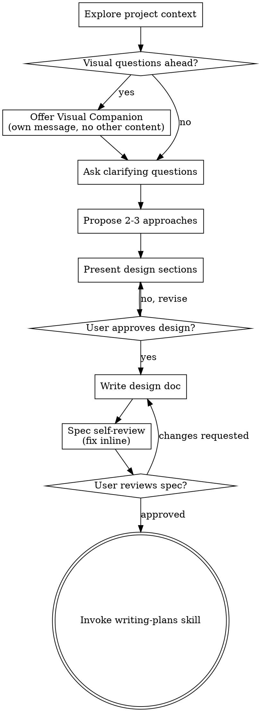

<!-- Generated by SpecStory, Markdown v2.1.0 -->

# 2026-04-24 04:30:26Z

<!-- Claude Code Session 23875497-644a-428f-9c77-bf32c5665661 (2026-04-24 04:30:26Z) -->

_**User (2026-04-24 04:30:26Z)**_

<ide_opened_file>The user opened the file /Users/leocaseiro/Sites/ipa-phonemes-recorder/.claude/handoffs/2026-04-24-add-missing-phonemes.md in the IDE. This may or may not be related to the current task.</ide_opened_file>

Let's keep working on the .claude/handoffs/2026-04-24-add-missing-phonemes.md. 
I also want to be able to edit the audio start/end. Is it possible to add a trim feature to our app on my recordings? Make sure to have undo (when happy, we can save as duplicated for the trims).

---

_**Agent (claude-opus-4-7 2026-04-24 04:30:31Z)**_

_**Agent (claude-opus-4-7 2026-04-24 04:30:31Z)**_

<tool-use data-tool-type="generic" data-tool-name="Skill"><details>
<summary>Tool use: **Skill**</summary>

```text
Launching skill: superpowers:brainstorming
```
</details></tool-use>

---

_**User (2026-04-24 04:30:31Z)**_

Base directory for this skill: /Users/leocaseiro/.claude/plugins/cache/claude-plugins-official/superpowers/5.0.7/skills/brainstorming

# Brainstorming Ideas Into Designs

Help turn ideas into fully formed designs and specs through natural collaborative dialogue.

Start by understanding the current project context, then ask questions one at a time to refine the idea. Once you understand what you're building, present the design and get user approval.

<HARD-GATE>
Do NOT invoke any implementation skill, write any code, scaffold any project, or take any implementation action until you have presented a design and the user has approved it. This applies to EVERY project regardless of perceived simplicity.
</HARD-GATE>

## Anti-Pattern: "This Is Too Simple To Need A Design"

Every project goes through this process. A todo list, a single-function utility, a config change — all of them. "Simple" projects are where unexamined assumptions cause the most wasted work. The design can be short (a few sentences for truly simple projects), but you MUST present it and get approval.

## Checklist

You MUST create a task for each of these items and complete them in order:

1. **Explore project context** — check files, docs, recent commits
2. **Offer visual companion** (if topic will involve visual questions) — this is its own message, not combined with a clarifying question. See the Visual Companion section below.
3. **Ask clarifying questions** — one at a time, understand purpose/constraints/success criteria
4. **Propose 2-3 approaches** — with trade-offs and your recommendation
5. **Present design** — in sections scaled to their complexity, get user approval after each section
6. **Write design doc** — save to `docs/superpowers/specs/YYYY-MM-DD-<topic>-design.md` and commit
7. **Spec self-review** — quick inline check for placeholders, contradictions, ambiguity, scope (see below)
8. **User reviews written spec** — ask user to review the spec file before proceeding
9. **Transition to implementation** — invoke writing-plans skill to create implementation plan

## Process Flow



**The terminal state is invoking writing-plans.** Do NOT invoke frontend-design, mcp-builder, or any other implementation skill. The ONLY skill you invoke after brainstorming is writing-plans.

## The Process

**Understanding the idea:**

- Check out the current project state first (files, docs, recent commits)
- Before asking detailed questions, assess scope: if the request describes multiple independent subsystems (e.g., "build a platform with chat, file storage, billing, and analytics"), flag this immediately. Don't spend questions refining details of a project that needs to be decomposed first.
- If the project is too large for a single spec, help the user decompose into sub-projects: what are the independent pieces, how do they relate, what order should they be built? Then brainstorm the first sub-project through the normal design flow. Each sub-project gets its own spec → plan → implementation cycle.
- For appropriately-scoped projects, ask questions one at a time to refine the idea
- Prefer multiple choice questions when possible, but open-ended is fine too
- Only one question per message - if a topic needs more exploration, break it into multiple questions
- Focus on understanding: purpose, constraints, success criteria

**Exploring approaches:**

- Propose 2-3 different approaches with trade-offs
- Present options conversationally with your recommendation and reasoning
- Lead with your recommended option and explain why

**Presenting the design:**

- Once you believe you understand what you're building, present the design
- Scale each section to its complexity: a few sentences if straightforward, up to 200-300 words if nuanced
- Ask after each section whether it looks right so far
- Cover: architecture, components, data flow, error handling, testing
- Be ready to go back and clarify if something doesn't make sense

**Design for isolation and clarity:**

- Break the system into smaller units that each have one clear purpose, communicate through well-defined interfaces, and can be understood and tested independently
- For each unit, you should be able to answer: what does it do, how do you use it, and what does it depend on?
- Can someone understand what a unit does without reading its internals? Can you change the internals without breaking consumers? If not, the boundaries need work.
- Smaller, well-bounded units are also easier for you to work with - you reason better about code you can hold in context at once, and your edits are more reliable when files are focused. When a file grows large, that's often a signal that it's doing too much.

**Working in existing codebases:**

- Explore the current structure before proposing changes. Follow existing patterns.
- Where existing code has problems that affect the work (e.g., a file that's grown too large, unclear boundaries, tangled responsibilities), include targeted improvements as part of the design - the way a good developer improves code they're working in.
- Don't propose unrelated refactoring. Stay focused on what serves the current goal.

## After the Design

**Documentation:**

- Write the validated design (spec) to `docs/superpowers/specs/YYYY-MM-DD-<topic>-design.md`
  - (User preferences for spec location override this default)
- Use elements-of-style:writing-clearly-and-concisely skill if available
- Commit the design document to git

**Spec Self-Review:**
After writing the spec document, look at it with fresh eyes:

1. **Placeholder scan:** Any "TBD", "TODO", incomplete sections, or vague requirements? Fix them.
2. **Internal consistency:** Do any sections contradict each other? Does the architecture match the feature descriptions?
3. **Scope check:** Is this focused enough for a single implementation plan, or does it need decomposition?
4. **Ambiguity check:** Could any requirement be interpreted two different ways? If so, pick one and make it explicit.

Fix any issues inline. No need to re-review — just fix and move on.

**User Review Gate:**
After the spec review loop passes, ask the user to review the written spec before proceeding:

> "Spec written and committed to `<path>`. Please review it and let me know if you want to make any changes before we start writing out the implementation plan."

Wait for the user's response. If they request changes, make them and re-run the spec review loop. Only proceed once the user approves.

**Implementation:**

- Invoke the writing-plans skill to create a detailed implementation plan
- Do NOT invoke any other skill. writing-plans is the next step.

## Key Principles

- **One question at a time** - Don't overwhelm with multiple questions
- **Multiple choice preferred** - Easier to answer than open-ended when possible
- **YAGNI ruthlessly** - Remove unnecessary features from all designs
- **Explore alternatives** - Always propose 2-3 approaches before settling
- **Incremental validation** - Present design, get approval before moving on
- **Be flexible** - Go back and clarify when something doesn't make sense

## Visual Companion

A browser-based companion for showing mockups, diagrams, and visual options during brainstorming. Available as a tool — not a mode. Accepting the companion means it's available for questions that benefit from visual treatment; it does NOT mean every question goes through the browser.

**Offering the companion:** When you anticipate that upcoming questions will involve visual content (mockups, layouts, diagrams), offer it once for consent:
> "Some of what we're working on might be easier to explain if I can show it to you in a web browser. I can put together mockups, diagrams, comparisons, and other visuals as we go. This feature is still new and can be token-intensive. Want to try it? (Requires opening a local URL)"

**This offer MUST be its own message.** Do not combine it with clarifying questions, context summaries, or any other content. The message should contain ONLY the offer above and nothing else. Wait for the user's response before continuing. If they decline, proceed with text-only brainstorming.

**Per-question decision:** Even after the user accepts, decide FOR EACH QUESTION whether to use the browser or the terminal. The test: **would the user understand this better by seeing it than reading it?**

- **Use the browser** for content that IS visual — mockups, wireframes, layout comparisons, architecture diagrams, side-by-side visual designs
- **Use the terminal** for content that is text — requirements questions, conceptual choices, tradeoff lists, A/B/C/D text options, scope decisions

A question about a UI topic is not automatically a visual question. "What does personality mean in this context?" is a conceptual question — use the terminal. "Which wizard layout works better?" is a visual question — use the browser.

If they agree to the companion, read the detailed guide before proceeding:
`skills/brainstorming/visual-companion.md`


---

_**Agent (claude-opus-4-7 2026-04-24 04:30:36Z)**_

_**Agent (claude-opus-4-7 2026-04-24 04:30:37Z)**_

I'll use brainstorming to design this properly. Let me start by exploring the project context.

_**Agent (claude-opus-4-7 2026-04-24 04:30:37Z)**_

<tool-use data-tool-type="read" data-tool-name="Read"><details>
<summary>Tool use: **Read**</summary>
 `./.claude/handoffs/2026-04-24-add-missing-phonemes.md`

```text
1	# Handoff: add missing phonemes to en-au-leo (schwa, ʒ, əʊ, ʊə)
2	
3	**Date:** 2026-04-24
4	**Branch:** `feat/new-bank-flow`
5	**Git status:** clean (6 untracked `.specstory/` churn, ignore)
6	**Commits ahead of master:** 2 (M9 landed locally, not yet merged)
7	**Last commit:** `2d81dac feat(ui): New bank button + modal form + wiring`
8	**PR:** none (this project does not use GitHub PRs yet)
9	
10	## Resume command
11	
12	```
13	cd ~/Sites/ipa-phonemes-recorder
14	python3.11 -m server.app   # run the app while editing
15	```
16	
17	Then open this handoff and work through §"Plan".
18	
19	## Current state
20	
21	**Task:** the user tried to voice `surprise /səˈpraɪz/` in British English and hit a blocker — **`ə` (plain schwa) is not in the bank inventory**. Separate audit revealed a second missing consonant (`ʒ`, "measure") and a British diphthong gap (`əʊ`, British goat). `ʊə` (cure) is a nice-to-have.
22	**Phase:** scoped + audited; not yet implemented.
23	**Progress:** 0 / 4 phonemes added.
24	
25	## What we did
26	
27	- Confirmed the IPA reading: the `sur-` in `/səˈpraɪz/` is `/ə/`, not `/ɜː/`, because the syllable is unstressed (English vowels reduce to schwa in unstressed positions). The `ˈ` is the primary-stress mark, not a phoneme.
28	- Audited the current 44-phoneme inventory in [banks/en-au-leo/config.json](../../banks/en-au-leo/config.json) against a standard English chart (GA + RP combined).
29	- Verified which reference files already exist under `references/polyu/` and which keys are mapped in `server/seeds/phoneme_polyu_files.json` and `phoneme_reference_files.json`.
30	
31	## Decisions made
32	
33	- **Add `ə` (schwa) as the top priority** — Why: it's the single most common English vowel, and without it any multi-syllable transcription collapses the moment it hits an unstressed syllable. How to apply: see §"Plan" below.
34	- **Add `ʒ` next** — Why: filling a real consonant gap (measure, vision, pleasure, genre). Both PolyU and vocab.com have files ready.
35	- **Add `əʊ` as a nice-to-have for British transcriptions** — Why: the bank is en-AU/British-leaning; RP "goat" is `/əʊ/`, not `/oʊ/`. The existing `ow = oʊ` can stay (it's valid GA); adding `əʊ` lets British dictionary entries map cleanly. How to apply: reuse PolyU `OH.mp3` (no British-specific recording exists in the set); the reference is close enough for a recording aid.
36	- **Defer `ʊə` (cure)** — Why: modern RP often collapses `/ʊə/` → `/ɔː/` (CURE → NORTH), and the phoneme is nearly extinct in younger speakers. Add only if the user finds a real-world word where they want to distinguish it. PolyU has `OO-ER.mp3` if we decide to add.
37	
38	## Audit — full 44-phoneme coverage vs standard English chart
39	
40	**Consonants (24 expected):** all present except **`ʒ`**.
41	**Monophthongs (11 expected):** all present except **`ə`**.
42	**Closing diphthongs (5 expected):** all present; British **`əʊ`** is absent (GA `oʊ` is present).
43	**Centring diphthongs (3 expected):** `ɪə` + `eə` + `ɛə` present (last two are effectively the same phoneme split by spelling — `there` vs `Mary`; harmless); **`ʊə`** absent.
44	**Other:** `juː`, `ks` digraphs present (unusual but fine).
45	
46	| Missing phoneme | Example | PolyU file | Vocabulary.com file | Priority |
47	| --- | --- | --- | --- | --- |
48	| `ə` | about, surprise, comma | `SCHWA.mp3` | `mid_central-gqxn5h.mp3` | **now** |
49	| `ʒ` | measure, vision, pleasure | `ZH.mp3` | `zh-fy90bw.mp3` | **now** |
50	| `əʊ` | goat (RP) | reuse `OH.mp3` | reuse `o-c3q2rv.mp3` | nice-to-have |
51	| `ʊə` | cure, tour (conservative RP) | `OO-ER.mp3` | — (none on chart) | defer |
52	
53	## Plan
54	
55	Four steps per phoneme. Do all three priority phonemes in one commit if working.
56	
57	### 1 — Add the phoneme entry to `banks/en-au-leo/config.json`
58	
59	Append to the `phonemes` array (the schema accepts any order; alphabetical-by-id-ish fits existing style):
60	
61	```json
62	{ "id": "schwa", "ipa": "ə",  "example": "about",   "loopable": true, "category": "vowel" },
63	{ "id": "zh",    "ipa": "ʒ",  "example": "measure", "loopable": true, "category": "consonant" },
64	{ "id": "oh",    "ipa": "əʊ", "example": "goat",    "loopable": true, "category": "diphthong" }
65	```
66	
67	`id` values must match `^[a-z0-9_]+$` per `server/schema.py`. `loopable: true` for all three (they're sustainable sounds).
68	
69	**Do not reuse `ow` for `əʊ`** — `ow` is already mapped to `oʊ`. Use a new id (`oh` proposed; `goat_rp` if you want it clearer).
70	
71	### 2 — Map each phoneme to a PolyU file
72	
73	Edit [server/seeds/phoneme_polyu_files.json](../../server/seeds/phoneme_polyu_files.json):
74	
75	```json
76	"schwa": "SCHWA.mp3",
77	"zh":    "ZH.mp3",
78	"oh":    "OH.mp3"
79	```
80	
81	### 3 — Map each phoneme to a Vocabulary.com file
82	
83	Edit [server/seeds/phoneme_reference_files.json](../../server/seeds/phoneme_reference_files.json):
84	
85	```json
86	"schwa": "mid_central-gqxn5h.mp3",
87	"zh":    "zh-fy90bw.mp3",
88	"oh":    "o-c3q2rv.mp3"
89	```
90	
91	Both source files already live under `references/` (checked on disk — `ls references/ | grep -E 'mid_central|zh|o-c3q'` returns all three). **No fetch script run needed for these three.**
92	
93	### 4 — Update the English-basic seed so new banks inherit the additions
94	
95	Edit [server/seeds/english-basic.json](../../server/seeds/english-basic.json) — add the same three phoneme entries to `phonemes`. Keeps new-bank-flow (M9) in sync.
96	
97	### 5 — Verify
98	
99	```bash
100	python3.11 -m unittest tests.test_references   # still 7/7
101	python3.11 -m server.app
102	```
103	
104	In the browser, select each new phoneme and press `G`. All three should play via PolyU (auto source picks PolyU first when present).
105	
106	Then test-voice the word "surprise" by cycling through `s`, `schwa`, `p`, `r`, `ai`, `z` — all should play.
107	
108	## Key files
109	
110	- [banks/en-au-leo/config.json](../../banks/en-au-leo/config.json) — phoneme inventory for the primary bank
111	- [server/seeds/english-basic.json](../../server/seeds/english-basic.json) — default inventory for new banks (mirrors en-au-leo)
112	- [server/seeds/phoneme_polyu_files.json](../../server/seeds/phoneme_polyu_files.json) — phoneme_id → PolyU filename map
113	- [server/seeds/phoneme_reference_files.json](../../server/seeds/phoneme_reference_files.json) — phoneme_id → Vocabulary.com filename map
114	- [server/schema.py](../../server/schema.py) — validates config.json; rejects duplicate ids / duplicate IPAs, so don't reuse `ow` for `əʊ`
115	- [references/polyu/](../../references/polyu/) — 48 audio files; `SCHWA.mp3`, `ZH.mp3`, `OH.mp3`, `OO-ER.mp3` already present
116	
117	## Open questions
118	
119	- [ ] Should `əʊ` get its own PolyU recording or just reuse `OH.mp3`? The PolyU set does not include a British-specific `əʊ` file. Reusing `OH.mp3` is the pragmatic call; flag if user wants a dedicated recording later.
120	- [ ] Should the bank's existing `e_schwa` (eə, "there") and `e_near` (ɛə, "Mary") be collapsed into one phoneme? They share the same PolyU mapping already and are merged in modern RP. Not blocking.
121	
122	## Context to remember
123	
124	- **User is Aussie / British-leaning.** Don't add rhotic-variant American vowels (ɚ, ɝ). The bank intentionally has both `oʊ` (GA) and should gain `əʊ` (RP) for transcription flexibility.
125	- **The IPA `ˈ` is a stress mark, not a sound.** If you see it in the user's transcription, ignore it when picking phonemes to record.
126	- **Vowel reduction is the rule.** Unstressed syllables in English become schwa regardless of spelling (`sur-` in surprise, `a` in about, `er` in "teacher"). Without `ə`, >50% of English multisyllabic words can't be fully voiced.
127	- **Testing memory still applies** — this is a feature addition, not a bug fix, so no regression tests required. But running `python3.11 -m unittest discover tests` after the changes is cheap and catches seed-file schema drift.
128	- **Don't run a fetch script for the priority three** — all files are already on disk. Only `ʊə` might need a fetch (from PolyU, the `OO-ER.mp3` is already there too; vocab.com has no matching file).
129	- **M9 is unmerged.** Current branch `feat/new-bank-flow` has the New-bank UI + endpoint. When picking up this handoff, the user may merge M9 to master first or not — the phoneme changes don't depend on it.
130
```
</details></tool-use>

_**Agent (claude-opus-4-7 2026-04-24 04:30:39Z)**_

<tool-use data-tool-type="shell" data-tool-name="Bash"><details>
<summary>Tool use: **Bash**</summary>
List project root

`ls /Users/leocaseiro/Sites/ipa-phonemes-recorder/`

```text
CLAUDE.md
LICENSE
README.md
banks
docs
references
scripts
server
tests
tmp
ui
```
</details></tool-use>

_**Agent (claude-opus-4-7 2026-04-24 04:30:48Z)**_

_**Agent (claude-opus-4-7 2026-04-24 04:30:48Z)**_

Let me look at the current UI and recording structure to understand the trim feature's context.

_**Agent (claude-opus-4-7 2026-04-24 04:30:50Z)**_

<tool-use data-tool-type="shell" data-tool-name="Bash"><details>
<summary>Tool use: **Bash**</summary>
List ui, server, and bank directories

`ls /Users/leocaseiro/Sites/ipa-phonemes-recorder/ui/ /Users/leocaseiro/Sites/ipa-phonemes-recorder/server/ /Users/leocaseiro/Sites/ipa-phonemes-recorder/banks/en-au-leo/`

```text
/Users/leocaseiro/Sites/ipa-phonemes-recorder/banks/en-au-leo/:
config.json
dist
raw
state.json

/Users/leocaseiro/Sites/ipa-phonemes-recorder/server/:
__init__.py
__pycache__
app.py
audio_meta.py
banks.py
export.py
ffmpeg_util.py
gitignore.py
references.py
schema.py
seeds
state.py
takes.py

/Users/leocaseiro/Sites/ipa-phonemes-recorder/ui/:
api.js
audio.js
index.html
main.js
record.js
styles.css
```
</details></tool-use>

_**Agent (claude-opus-4-7 2026-04-24 04:30:50Z)**_

<tool-use data-tool-type="shell" data-tool-name="Bash"><details>
<summary>Tool use: **Bash**</summary>
List docs directory

`ls /Users/leocaseiro/Sites/ipa-phonemes-recorder/docs/`

```text
plans
specs
```
</details></tool-use>

_**Agent (claude-opus-4-7 2026-04-24 04:30:54Z)**_

<tool-use data-tool-type="shell" data-tool-name="Bash"><details>
<summary>Tool use: **Bash**</summary>
Inspect raw takes and takes API

`ls /Users/leocaseiro/Sites/ipa-phonemes-recorder/banks/en-au-leo/raw/ 2>/dev/null | head -20; echo "---takes api---"; grep -n "take\|trim\|raw" /Users/leocaseiro/Sites/ipa-phonemes-recorder/server/takes.py 2>/dev/null | head -30`

```text
ae
ah
ai
au
b
ch
d
dzh
e
e_near
e_schwa
ee
er
ey
f
g
h
i_schwa
ih
j
---takes api---
8:This preserves a stable history even when takes are deleted.
25:TAKE_ID_RE = re.compile(r"^take-(\d+)$")
31:    take_id: str
48:    def __init__(self, phoneme_id: str, take_id: str):
50:        self.take_id = take_id
51:        super().__init__(f"take not found: {phoneme_id}/{take_id}")
54:def next_take_id(phoneme_dir: Path, state: dict, phoneme_id: str) -> str:
55:    """Next id to assign for a new take of `phoneme_id`.
57:    Spec §6.3 / plan §10.3 step 4: take IDs are monotonic per phoneme
59:    "has this id ever existed?" is `state.phonemes[pid].max_take_id`,
62:    first write against a pre-existing raw/ directory still picks a
68:        stored = phoneme_state.get("max_take_id")
71:        for take in phoneme_state.get("takes", []):
72:            if not isinstance(take, dict):
74:            m = TAKE_ID_RE.match(take.get("id", ""))
84:    return f"take-{max_n + 1:03d}"
87:def save_take(
96:    phoneme_dir = bank_path / "raw" / phoneme_id
98:    take_id = next_take_id(phoneme_dir, state, phoneme_id)
102:    tmp_src = tmp_dir / f"{take_id}{src_ext}"
106:    wav_path = phoneme_dir / f"{take_id}.wav"
156:        phonemes[phoneme_id] = {"keeper_take": None, "takes": []}
158:    phoneme_entry.setdefault("keeper_take", None)
159:    phoneme_entry.setdefault("takes", [])
160:    phoneme_entry["takes"].append(
162:            "id": take_id,
170:    new_number = int(take_id.removeprefix("take-"))
171:    current_high = phoneme_entry.get("max_take_id")
173:        phoneme_entry["max_take_id"] = new_number
183:        take_id=take_id,
```
</details></tool-use>

_**Agent (claude-opus-4-7 2026-04-24 04:30:54Z)**_

<tool-use data-tool-type="shell" data-tool-name="Bash"><details>
<summary>Tool use: **Bash**</summary>
Line counts of key files

`wc -l /Users/leocaseiro/Sites/ipa-phonemes-recorder/ui/*.js /Users/leocaseiro/Sites/ipa-phonemes-recorder/server/*.py`

```text
     217 /Users/leocaseiro/Sites/ipa-phonemes-recorder/ui/api.js
     172 /Users/leocaseiro/Sites/ipa-phonemes-recorder/ui/audio.js
    1271 /Users/leocaseiro/Sites/ipa-phonemes-recorder/ui/main.js
      73 /Users/leocaseiro/Sites/ipa-phonemes-recorder/ui/record.js
       3 /Users/leocaseiro/Sites/ipa-phonemes-recorder/server/__init__.py
     954 /Users/leocaseiro/Sites/ipa-phonemes-recorder/server/app.py
      75 /Users/leocaseiro/Sites/ipa-phonemes-recorder/server/audio_meta.py
     278 /Users/leocaseiro/Sites/ipa-phonemes-recorder/server/banks.py
     287 /Users/leocaseiro/Sites/ipa-phonemes-recorder/server/export.py
      99 /Users/leocaseiro/Sites/ipa-phonemes-recorder/server/ffmpeg_util.py
     103 /Users/leocaseiro/Sites/ipa-phonemes-recorder/server/gitignore.py
     232 /Users/leocaseiro/Sites/ipa-phonemes-recorder/server/references.py
      99 /Users/leocaseiro/Sites/ipa-phonemes-recorder/server/schema.py
     122 /Users/leocaseiro/Sites/ipa-phonemes-recorder/server/state.py
     236 /Users/leocaseiro/Sites/ipa-phonemes-recorder/server/takes.py
    4221 total
```
</details></tool-use>

_**Agent (claude-opus-4-7 2026-04-24 04:30:58Z)**_

<tool-use data-tool-type="read" data-tool-name="Read"><details>
<summary>Tool use: **Read**</summary>
 `./server/takes.py`

```text
1	# This Source Code Form is subject to the terms of the Mozilla Public
2	# License, v. 2.0. If a copy of the MPL was not distributed with this
3	# file, You can obtain one at https://mozilla.org/MPL/2.0/.
4	"""Take recording: transcode upload, compute metadata, update state.
5	
6	Take IDs are monotonic within a phoneme and never reused — the next
7	id is `max(state_ids ∪ disk_ids) + 1`, zero-padded to three digits.
8	This preserves a stable history even when takes are deleted.
9	"""
10	
11	from __future__ import annotations
12	
13	import logging
14	import re
15	import subprocess
16	from dataclasses import dataclass
17	from datetime import datetime, timezone
18	from pathlib import Path
19	
20	from server.audio_meta import compute_peak_rms
21	from server.state import read_state, write_state
22	
23	logger = logging.getLogger(__name__)
24	
25	TAKE_ID_RE = re.compile(r"^take-(\d+)$")
26	FFMPEG_TIMEOUT_SECONDS = 30
27	
28	
29	@dataclass
30	class TakeMeta:
31	    take_id: str
32	    duration_ms: int
33	    peak_db: float
34	    rms_db: float
35	    created_at: str
36	
37	
38	class TakeSaveFailed(Exception):
39	    def __init__(self, code: str, message: str, detail: str = "", tmp_path: Path | None = None):
40	        self.code = code
41	        self.message = message
42	        self.detail = detail
43	        self.tmp_path = tmp_path
44	        super().__init__(f"{code}: {message}")
45	
46	
47	class TakeNotFound(Exception):
48	    def __init__(self, phoneme_id: str, take_id: str):
49	        self.phoneme_id = phoneme_id
50	        self.take_id = take_id
51	        super().__init__(f"take not found: {phoneme_id}/{take_id}")
52	
53	
54	def next_take_id(phoneme_dir: Path, state: dict, phoneme_id: str) -> str:
55	    """Next id to assign for a new take of `phoneme_id`.
56	
57	    Spec §6.3 / plan §10.3 step 4: take IDs are monotonic per phoneme
58	    and are **never reused** even after delete. The source of truth for
59	    "has this id ever existed?" is `state.phonemes[pid].max_take_id`,
60	    a persisted high-water mark that is bumped on save and never
61	    decremented. Current state and disk are also consulted so the
62	    first write against a pre-existing raw/ directory still picks a
63	    safe id.
64	    """
65	    max_n = 0
66	    phoneme_state = state.get("phonemes", {}).get(phoneme_id, {})
67	    if isinstance(phoneme_state, dict):
68	        stored = phoneme_state.get("max_take_id")
69	        if isinstance(stored, int) and stored > max_n:
70	            max_n = stored
71	        for take in phoneme_state.get("takes", []):
72	            if not isinstance(take, dict):
73	                continue
74	            m = TAKE_ID_RE.match(take.get("id", ""))
75	            if m:
76	                max_n = max(max_n, int(m.group(1)))
77	    if phoneme_dir.is_dir():
78	        for wav in phoneme_dir.iterdir():
79	            if wav.suffix != ".wav":
80	                continue
81	            m = TAKE_ID_RE.match(wav.stem)
82	            if m:
83	                max_n = max(max_n, int(m.group(1)))
84	    return f"take-{max_n + 1:03d}"
85	
86	
87	def save_take(
88	    *,
89	    bank_path: Path,
90	    phoneme_id: str,
91	    src_bytes: bytes,
92	    src_ext: str,
93	    ffmpeg: Path,
94	    tmp_root: Path,
95	) -> TakeMeta:
96	    phoneme_dir = bank_path / "raw" / phoneme_id
97	    state = read_state(bank_path)
98	    take_id = next_take_id(phoneme_dir, state, phoneme_id)
99	
100	    tmp_dir = tmp_root / bank_path.name / phoneme_id
101	    tmp_dir.mkdir(parents=True, exist_ok=True)
102	    tmp_src = tmp_dir / f"{take_id}{src_ext}"
103	    tmp_src.write_bytes(src_bytes)
104	
105	    phoneme_dir.mkdir(parents=True, exist_ok=True)
106	    wav_path = phoneme_dir / f"{take_id}.wav"
107	
108	    try:
109	        result = subprocess.run(
110	            [
111	                str(ffmpeg), "-y", "-i", str(tmp_src),
112	                "-ar", "48000", "-ac", "1", "-c:a", "pcm_s16le",
113	                str(wav_path),
114	            ],
115	            capture_output=True,
116	            text=True,
117	            timeout=FFMPEG_TIMEOUT_SECONDS,
118	        )
119	    except subprocess.TimeoutExpired as exc:
120	        raise TakeSaveFailed(
121	            "ffmpeg_timeout",
122	            f"ffmpeg timed out after {FFMPEG_TIMEOUT_SECONDS}s",
123	            tmp_path=tmp_src,
124	        ) from exc
125	
126	    if result.returncode != 0:
127	        if wav_path.exists():
128	            wav_path.unlink()
129	        raise TakeSaveFailed(
130	            "ffmpeg_failed",
131	            "transcoding failed",
132	            detail=result.stderr[-1500:],
133	            tmp_path=tmp_src,
134	        )
135	
136	    try:
137	        peak_db, rms_db, duration_ms = compute_peak_rms(wav_path)
138	    except Exception as exc:
139	        wav_path.unlink(missing_ok=True)
140	        raise TakeSaveFailed(
141	            "wav_unreadable",
142	            "transcoded WAV could not be measured",
143	            detail=str(exc),
144	            tmp_path=tmp_src,
145	        ) from exc
146	
147	    created_at = (
148	        datetime.now(timezone.utc)
149	        .replace(microsecond=0)
150	        .isoformat()
151	        .replace("+00:00", "Z")
152	    )
153	
154	    phonemes = state.setdefault("phonemes", {})
155	    if phoneme_id not in phonemes:
156	        phonemes[phoneme_id] = {"keeper_take": None, "takes": []}
157	    phoneme_entry = phonemes[phoneme_id]
158	    phoneme_entry.setdefault("keeper_take", None)
159	    phoneme_entry.setdefault("takes", [])
160	    phoneme_entry["takes"].append(
161	        {
162	            "id": take_id,
163	            "created_at": created_at,
164	            "duration_ms": duration_ms,
165	            "peak_db": peak_db,
166	            "rms_db": rms_db,
167	            "notes": "",
168	        }
169	    )
170	    new_number = int(take_id.removeprefix("take-"))
171	    current_high = phoneme_entry.get("max_take_id")
172	    if not isinstance(current_high, int) or new_number > current_high:
173	        phoneme_entry["max_take_id"] = new_number
174	    state["last_phoneme_id"] = phoneme_id
175	    write_state(bank_path, state)
176	
177	    try:
178	        tmp_src.unlink(missing_ok=True)
179	    except OSError as exc:
180	        logger.warning("could not clean up %s: %s", tmp_src, exc)
181	
182	    return TakeMeta(
183	        take_id=take_id,
184	        duration_ms=duration_ms,
185	        peak_db=peak_db,
186	        rms_db=rms_db,
187	        created_at=created_at,
188	    )
189	
190	
191	def get_take_wav_path(bank_path: Path, phoneme_id: str, take_id: str) -> Path:
192	    if not TAKE_ID_RE.match(take_id):
193	        raise TakeNotFound(phoneme_id, take_id)
194	    wav = bank_path / "raw" / phoneme_id / f"{take_id}.wav"
195	    if not wav.is_file():
196	        raise TakeNotFound(phoneme_id, take_id)
197	    return wav
198	
199	
200	def delete_take(*, bank_path: Path, phoneme_id: str, take_id: str) -> dict:
201	    """Remove the take's WAV + state entry. Returns the updated state.
202	
203	    Siblings are not renumbered — take IDs are monotonic forever. If
204	    the take was the keeper, clears keeper_take on that phoneme.
205	    Raises TakeNotFound if neither the state entry nor the WAV exists.
206	    """
207	    if not TAKE_ID_RE.match(take_id):
208	        raise TakeNotFound(phoneme_id, take_id)
209	
210	    state = read_state(bank_path)
211	    phoneme = state.get("phonemes", {}).get(phoneme_id, {})
212	    takes = phoneme.get("takes", []) if isinstance(phoneme, dict) else []
213	    wav_path = bank_path / "raw" / phoneme_id / f"{take_id}.wav"
214	
215	    has_state_entry = any(
216	        isinstance(t, dict) and t.get("id") == take_id for t in takes
217	    )
218	    has_disk = wav_path.is_file()
219	    if not has_state_entry and not has_disk:
220	        raise TakeNotFound(phoneme_id, take_id)
221	
222	    if isinstance(phoneme, dict):
223	        phoneme["takes"] = [
224	            t for t in takes if not (isinstance(t, dict) and t.get("id") == take_id)
225	        ]
226	        if phoneme.get("keeper_take") == take_id:
227	            phoneme["keeper_take"] = None
228	    write_state(bank_path, state)
229	
230	    if has_disk:
231	        try:
232	            wav_path.unlink()
233	        except OSError as exc:
234	            logger.warning("failed to remove %s: %s", wav_path, exc)
235	
236	    return state
237
```
</details></tool-use>

_**Agent (claude-opus-4-7 2026-04-24 04:31:01Z)**_

<tool-use data-tool-type="shell" data-tool-name="Bash"><details>
<summary>Tool use: **Bash**</summary>
Sample take files and state

`ls /Users/leocaseiro/Sites/ipa-phonemes-recorder/banks/en-au-leo/raw/schwa/ 2>/dev/null; echo "---"; ls /Users/leocaseiro/Sites/ipa-phonemes-recorder/banks/en-au-leo/raw/ae/ 2>/dev/null | head -10; echo "---state---"; grep -A 5 "takes" /Users/leocaseiro/Sites/ipa-phonemes-recorder/banks/en-au-leo/state.json | head -40`

```text
---
take-001.wav
take-002.wav
---state---
      "takes": [
        {
          "id": "take-003",
          "created_at": "2026-04-23T12:42:27Z",
          "duration_ms": 2400,
          "peak_db": -16.7,
--
      "takes": [
        {
          "id": "take-002",
          "created_at": "2026-04-23T12:41:34Z",
          "duration_ms": 2940,
          "peak_db": -7.1,
--
      "takes": [
        {
          "id": "take-002",
          "created_at": "2026-04-23T12:19:29Z",
          "duration_ms": 1980,
          "peak_db": -15.1,
--
      "takes": [
        {
          "id": "take-001",
          "created_at": "2026-04-23T12:20:22Z",
          "duration_ms": 2280,
          "peak_db": -8.8,
--
      "takes": [
        {
          "id": "take-001",
          "created_at": "2026-04-23T12:20:54Z",
          "duration_ms": 1800,
          "peak_db": -8.5,
--
      "takes": [
        {
          "id": "take-001",
          "created_at": "2026-04-23T12:21:03Z",
          "duration_ms": 2700,
```
</details></tool-use>

_**Agent (claude-opus-4-7 2026-04-24 04:31:03Z)**_

<tool-use data-tool-type="unknown" data-tool-name="ToolSearch"><details>
<summary>Tool use: **ToolSearch**</summary>

**Input:**

- max_results: `1`
- query: `select:TodoWrite`

**Result:**

```

```
</details></tool-use>

_**Agent (claude-opus-4-7 2026-04-24 04:31:07Z)**_

_**Agent (claude-opus-4-7 2026-04-24 04:31:10Z)**_

<tool-use data-tool-type="task" data-tool-name="TodoWrite"><details>
<summary>Tool use: **TodoWrite**</summary>
**Agent task list:**
- [⚡] 🌡️ Explore project context for trim feature
- [ ] 🌡️ Ask clarifying questions one at a time
- [ ] 🌡️ Propose 2-3 approaches with tradeoffs
- [ ] 🌡️ Present design sections for approval
- [ ] 🌡️ Write design doc to docs/specs/
- [ ] 🌡️ Spec self-review
- [ ] 🌡️ User reviews spec
- [ ] 🌡️ Invoke writing-plans skill

</details></tool-use>

_**Agent (claude-opus-4-7 2026-04-24 04:31:11Z)**_

<tool-use data-tool-type="read" data-tool-name="Read"><details>
<summary>Tool use: **Read**</summary>
 `./ui/audio.js`

```text
1	// This Source Code Form is subject to the terms of the Mozilla Public
2	// License, v. 2.0. If a copy of the MPL was not distributed with this
3	// file, You can obtain one at https://mozilla.org/MPL/2.0/.
4	//
5	// Audio graph owner. Holds the shared AudioContext, the mic stream,
6	// and the Analyser for metering. Also decodes committed WAVs into
7	// waveform renders. No recording logic — that lands in M4.
8	
9	const DB_FLOOR = -60;
10	
11	let audioContext = null;
12	let micStream = null;
13	let meterState = null;
14	let playbackSource = null;
15	
16	function ensureContext() {
17	  if (!audioContext) {
18	    const Ctx = window.AudioContext ?? window.webkitAudioContext;
19	    audioContext = new Ctx();
20	  }
21	  return audioContext;
22	}
23	
24	function deviceLabel(stream) {
25	  const track = stream.getAudioTracks()[0];
26	  return track?.label?.trim() || "Default microphone";
27	}
28	
29	function toDb(linear) {
30	  if (!Number.isFinite(linear) || linear <= 0) return DB_FLOOR;
31	  const db = 20 * Math.log10(linear);
32	  return db < DB_FLOOR ? DB_FLOOR : db;
33	}
34	
35	export async function requestMic() {
36	  if (micStream) return { stream: micStream, device: deviceLabel(micStream) };
37	  const stream = await navigator.mediaDevices.getUserMedia({ audio: true });
38	  const ctx = ensureContext();
39	  if (ctx.state === "suspended") {
40	    try {
41	      await ctx.resume();
42	    } catch {
43	      // non-fatal; iOS/Safari sometimes needs a gesture
44	    }
45	  }
46	  micStream = stream;
47	  return { stream, device: deviceLabel(stream) };
48	}
49	
50	export function startMeter(onLevel) {
51	  if (!micStream) throw new Error("startMeter called before requestMic");
52	  if (meterState) stopMeter();
53	
54	  const ctx = ensureContext();
55	  const source = ctx.createMediaStreamSource(micStream);
56	  const analyser = ctx.createAnalyser();
57	  analyser.fftSize = 2048;
58	  analyser.smoothingTimeConstant = 0.3;
59	  source.connect(analyser);
60	
61	  const buffer = new Float32Array(analyser.fftSize);
62	  const state = { rafId: 0, analyser, source };
63	  meterState = state;
64	
65	  function tick() {
66	    analyser.getFloatTimeDomainData(buffer);
67	    let peak = 0;
68	    let sumSquares = 0;
69	    for (let i = 0; i < buffer.length; i++) {
70	      const sample = buffer[i];
71	      const abs = Math.abs(sample);
72	      if (abs > peak) peak = abs;
73	      sumSquares += sample * sample;
74	    }
75	    const rms = Math.sqrt(sumSquares / buffer.length);
76	    onLevel({ peakDb: toDb(peak), rmsDb: toDb(rms) });
77	    state.rafId = requestAnimationFrame(tick);
78	  }
79	
80	  state.rafId = requestAnimationFrame(tick);
81	}
82	
83	export function stopMeter() {
84	  if (!meterState) return;
85	  cancelAnimationFrame(meterState.rafId);
86	  try {
87	    meterState.source.disconnect();
88	  } catch {
89	    // ignore — already disconnected
90	  }
91	  meterState = null;
92	}
93	
94	export async function renderWaveform(canvas, arrayBuffer) {
95	  const ctx = ensureContext();
96	  const audioBuffer = await ctx.decodeAudioData(arrayBuffer.slice(0));
97	  const data = audioBuffer.getChannelData(0);
98	  paintWaveform(canvas, data);
99	}
100	
101	export async function playBuffer(arrayBuffer, { onEnded } = {}) {
102	  const ctx = ensureContext();
103	  if (ctx.state === "suspended") {
104	    try {
105	      await ctx.resume();
106	    } catch {
107	      // non-fatal
108	    }
109	  }
110	  stopPlayback();
111	  const audioBuffer = await ctx.decodeAudioData(arrayBuffer.slice(0));
112	  const source = ctx.createBufferSource();
113	  source.buffer = audioBuffer;
114	  source.connect(ctx.destination);
115	  source.onended = () => {
116	    if (playbackSource === source) {
117	      playbackSource = null;
118	      onEnded?.();
119	    }
120	  };
121	  playbackSource = source;
122	  source.start();
123	  return source;
124	}
125	
126	export function stopPlayback() {
127	  if (!playbackSource) return;
128	  try {
129	    playbackSource.stop();
130	  } catch {
131	    // already stopped
132	  }
133	  playbackSource = null;
134	}
135	
136	export function isPlaying() {
137	  return playbackSource !== null;
138	}
139	
140	function paintWaveform(canvas, data) {
141	  const ctx2d = canvas.getContext("2d");
142	  const width = canvas.width;
143	  const height = canvas.height;
144	  const mid = height / 2;
145	  const binSize = Math.max(1, Math.floor(data.length / width));
146	  const stroke =
147	    getComputedStyle(canvas).getPropertyValue("--waveform").trim() || "#6aa9ff";
148	
149	  ctx2d.clearRect(0, 0, width, height);
150	  ctx2d.fillStyle = stroke;
151	
152	  for (let x = 0; x < width; x++) {
153	    let min = 1;
154	    let max = -1;
155	    const start = x * binSize;
156	    const end = Math.min(start + binSize, data.length);
157	    for (let i = start; i < end; i++) {
158	      const sample = data[i];
159	      if (sample < min) min = sample;
160	      if (sample > max) max = sample;
161	    }
162	    if (min === 1 && max === -1) {
163	      min = 0;
164	      max = 0;
165	    }
166	    const yTop = mid - max * mid;
167	    const yBottom = mid - min * mid;
168	    ctx2d.fillRect(x, yTop, 1, Math.max(1, yBottom - yTop));
169	  }
170	}
171	
172	export const DB_FLOOR_CONST = DB_FLOOR;
173
```
</details></tool-use>

_**Agent (claude-opus-4-7 2026-04-24 04:31:14Z)**_

_**Agent (claude-opus-4-7 2026-04-24 04:31:14Z)**_

Got it — trim lives on the take waveform. Let me look at how takes and waveforms render in the UI.

_**Agent (claude-opus-4-7 2026-04-24 04:31:16Z)**_

<tool-use data-tool-type="shell" data-tool-name="Bash"><details>
<summary>Tool use: **Bash**</summary>
Find waveform and take rendering

`grep -n "waveform\|renderWaveform\|take.*wav\|take-row\|takeRow" /Users/leocaseiro/Sites/ipa-phonemes-recorder/ui/main.js | head -40`

```text
22:  renderWaveform,
355:         <canvas class="take-waveform" height="80" aria-label="Waveform of selected take"></canvas>`}
1168:  const canvas = phonemeDetail.querySelector(".take-waveform");
1183:    await renderWaveform(canvas, buffer);
```
</details></tool-use>

_**Agent (claude-opus-4-7 2026-04-24 04:31:17Z)**_

<tool-use data-tool-type="shell" data-tool-name="Bash"><details>
<summary>Tool use: **Bash**</summary>
Take and wav references in html and api

`grep -n "take\|wav\|waveform" /Users/leocaseiro/Sites/ipa-phonemes-recorder/ui/index.html; echo "---api---"; grep -n "take\|wav" /Users/leocaseiro/Sites/ipa-phonemes-recorder/ui/api.js`

```text
---api---
68:export async function getTakeWav(bankId, phonemeId, takeId) {
70:    `/api/banks/${encodeURIComponent(bankId)}/phonemes/${encodeURIComponent(phonemeId)}/takes/${encodeURIComponent(takeId)}`,
80:export async function deleteTake(bankId, phonemeId, takeId) {
82:    `/api/banks/${encodeURIComponent(bankId)}/phonemes/${encodeURIComponent(phonemeId)}/takes/${encodeURIComponent(takeId)}`,
196:    `/api/banks/${encodeURIComponent(bankId)}/phonemes/${encodeURIComponent(phonemeId)}/takes`,
```
</details></tool-use>

_**Agent (claude-opus-4-7 2026-04-24 04:31:20Z)**_

<tool-use data-tool-type="read" data-tool-name="Read"><details>
<summary>Tool use: **Read**</summary>
 `./ui/main.js`

```text
330	    })
331	    .join("");
332	  phonemeDetail.innerHTML = `
333	    <div class="phoneme-detail__header">
334	      <span class="phoneme-detail__ipa">${escapeHtml(phoneme.ipa)}</span>
335	      <span class="phoneme-detail__example">${renderExamples(phoneme.example)}</span>
336	      <div class="reference-controls">
337	        <label class="ref-source-label">Reference
338	          <select id="ref-source" class="ref-source" aria-label="Reference clip source">${refOpts}</select>
339	        </label>
340	        <button class="reference-btn" data-action="play-reference" type="button" aria-label="Play reference audio (G)">
341	          ▶ <kbd>G</kbd>
342	        </button>
343	      </div>
344	    </div>
345	    <p id="reference-attribution" class="reference-attribution" hidden></p>
346	    <dl class="phoneme-detail__meta">
347	      <dt>Id</dt><dd>${escapeHtml(phoneme.id)}</dd>
348	      <dt>Category</dt><dd>${escapeHtml(phoneme.category ?? "—")}</dd>
349	      <dt>Loopable</dt><dd>${phoneme.loopable ? "yes" : "no"}</dd>
350	    </dl>
351	    <h2 class="takes-heading">Takes (${takes.length})</h2>
352	    ${takes.length === 0
353	      ? '<p class="placeholder">No takes yet. Press R (or click Record) to record one.</p>'
354	      : `<ul class="takes-list">${takes.map((t) => renderTakeRow(t, keeperTakeId)).join("")}</ul>
355	         <canvas class="take-waveform" height="80" aria-label="Waveform of selected take"></canvas>`}
356	  `;
357	}
358	
359	function renderTakeRow(take, keeperTakeId) {
360	  if (pendingDeleteTakeId === take.id) {
361	    return `
362	      <li class="takes-item takes-item--pending-delete" data-take-id="${escapeHtml(take.id)}">
363	        <span class="takes-item__confirm-message">Delete ${escapeHtml(take.id)}?</span>
364	        <div class="takes-item__confirm-actions">
365	          <button class="takes-btn" data-action="cancel-delete" type="button">Cancel</button>
366	          <button class="takes-btn takes-btn--danger" data-action="confirm-delete" type="button">Delete</button>
367	        </div>
368	      </li>
369	    `;
370	  }
371	
372	  const isKeeper = take.id === keeperTakeId;
373	  const isSelected = take.id === selectedTakeId;
374	  const isThisPlaying = take.id === playingTakeId;
375	  const playGlyph = isThisPlaying ? "■" : "▶";
376	  const classes = [
377	    "takes-item",
378	    isKeeper ? "takes-item--keeper" : "",
379	    isSelected ? "takes-item--selected" : "",
380	  ]
381	    .filter(Boolean)
382	    .join(" ");
383	  return `
384	    <li class="${classes}" data-take-id="${escapeHtml(take.id)}">
385	      <button class="takes-btn takes-btn--play" data-action="play" type="button" aria-label="Play ${escapeHtml(take.id)}">${playGlyph}</button>
386	      <span class="takes-item__id">${escapeHtml(take.id)}</span>
387	      <span class="takes-item__duration">${take.duration_ms} ms</span>
388	      <span class="takes-item__peak">peak ${formatDb(take.peak_db)}</span>
389	      <span class="takes-item__rms">rms ${formatDb(take.rms_db)}</span>
390	      <button class="takes-btn takes-btn--keeper ${isKeeper ? "takes-btn--keeper-on" : ""}" data-action="keeper" type="button" aria-pressed="${isKeeper}">${isKeeper ? "★ Keeper" : "☆ Keeper"}</button>
391	      <button class="takes-btn takes-btn--delete" data-action="delete" type="button" aria-label="Delete ${escapeHtml(take.id)}">🗑</button>
392	    </li>
393	  `;
394	}
395	
396	function formatDb(db) {
397	  const sign = db > 0 ? "+" : "";
398	  return `${sign}${Number(db).toFixed(1)} dB`;
399	}
400	
401	function renderEmpty(message) {
402	  phonemeList.innerHTML = "";
403	  phonemeDetail.innerHTML = `<p class="placeholder">${escapeHtml(message)}</p>`;
404	}
405	
406	function handleKeyDown(event) {
407	  const tag = document.activeElement?.tagName;
408	  if (tag === "INPUT" || tag === "TEXTAREA" || tag === "SELECT") return;
409
```
</details></tool-use>

_**Agent (claude-opus-4-7 2026-04-24 04:31:21Z)**_

<tool-use data-tool-type="read" data-tool-name="Read"><details>
<summary>Tool use: **Read**</summary>
 `./ui/main.js`

```text
1140	  }
1141	  renderPhonemeList(currentBank);
1142	  refreshDetailOnly();
1143	
1144	  try {
1145	    await deleteTake(bankId, phonemeId, takeId);
1146	    showToast(`Deleted ${takeId}`, "success");
1147	    if (selectedTakeId) paintWaveformForSelectedTake();
1148	  } catch (err) {
1149	    phonemeState.takes = previousTakes;
1150	    phonemeState.keeper_take = previousKeeper;
1151	    renderPhonemeList(currentBank);
1152	    refreshDetailOnly();
1153	    showToast(`Delete failed: ${err.message}`, "error");
1154	  }
1155	}
1156	
1157	function refreshDetailOnly() {
1158	  if (!selectedPhonemeId || !currentBank) return;
1159	  const phoneme = currentBank.config.phonemes.find((p) => p.id === selectedPhonemeId);
1160	  if (phoneme) {
1161	    renderDetail(phoneme);
1162	    paintWaveformForSelectedTake();
1163	  }
1164	}
1165	
1166	async function paintWaveformForSelectedTake() {
1167	  if (!selectedTakeId || !selectedPhonemeId) return;
1168	  const canvas = phonemeDetail.querySelector(".take-waveform");
1169	  if (!canvas) return;
1170	  sizeCanvasToDisplay(canvas);
1171	  const bankId = bankSelect.value;
1172	  const phonemeId = selectedPhonemeId;
1173	  const takeId = selectedTakeId;
1174	  let buffer;
1175	  try {
1176	    buffer = await getTakeWav(bankId, phonemeId, takeId);
1177	  } catch {
1178	    return;
1179	  }
1180	  // Race: selection may have moved while fetching.
1181	  if (selectedPhonemeId !== phonemeId || selectedTakeId !== takeId) return;
1182	  try {
1183	    await renderWaveform(canvas, buffer);
1184	  } catch {
1185	    // decodeAudioData can throw on odd inputs; silent.
1186	  }
1187	}
1188	
1189	function sizeCanvasToDisplay(canvas) {
1190	  const dpr = window.devicePixelRatio || 1;
1191	  const rect = canvas.getBoundingClientRect();
1192	  if (rect.width === 0) return;
1193	  canvas.width = Math.floor(rect.width * dpr);
1194	  canvas.height = Math.floor(rect.height * dpr);
1195	}
1196	
1197	function updateRecordButton() {
1198	  if (savingTake) {
1199	    recordButton.disabled = true;
1200	    recordButton.textContent = "Saving…";
1201	    recordButton.classList.remove("record-button--recording");
1202	    return;
1203	  }
1204	  const recording = isRecording();
1205	  if (!micStream) {
1206	    recordButton.disabled = true;
1207	  } else if (recording) {
1208	    recordButton.disabled = false;
1209	  } else {
1210	    recordButton.disabled = !toolsOk;
1211	  }
1212	  recordButton.textContent = recording ? "Stop" : "Record";
1213	  recordButton.classList.toggle("record-button--recording", recording);
1214	}
1215	
1216	function ensureToast() {
1217	  const el = document.createElement("div");
1218	  el.className = "toast";
1219	  el.hidden = true;
```
</details></tool-use>

_**Agent (claude-opus-4-7 2026-04-24 04:31:21Z)**_

<tool-use data-tool-type="read" data-tool-name="Read"><details>
<summary>Tool use: **Read**</summary>
 `./server/app.py`

```text
1	# This Source Code Form is subject to the terms of the Mozilla Public
2	# License, v. 2.0. If a copy of the MPL was not distributed with this
3	# file, You can obtain one at https://mozilla.org/MPL/2.0/.
4	"""HTTP server for the IPA phonemes recorder."""
5	
6	from __future__ import annotations
7	
8	import sys
9	
10	if sys.version_info < (3, 10):
11	    sys.stderr.write(
12	        f"ipa-phonemes-recorder requires Python 3.10+, got {sys.version.split()[0]}. "
13	        f"Try: python3.11 -m server.app\n"
14	    )
15	    raise SystemExit(1)
16	
17	import argparse
18	import json
19	import os
20	import re
21	import shutil
22	from dataclasses import asdict, dataclass
23	from http import HTTPStatus
24	from http.server import BaseHTTPRequestHandler, ThreadingHTTPServer
25	from pathlib import Path
26	from urllib.parse import parse_qs, urlparse
27	
28	from server.banks import (
29	    BankIdExists,
30	    BankInvalid,
31	    BankNotFound,
32	    CreateBankInvalid,
33	    create_bank,
34	    list_banks,
35	    read_bank,
36	)
37	from server.export import ExportError, ExportSummary, export_bank
38	from server.ffmpeg_util import FfmpegError
39	from server.gitignore import GitignoreSyncFailed, sync as sync_gitignore
40	from server.schema import validate_config
41	from server.references import (
42	    REFERENCE_SOURCES,
43	    ReferenceError,
44	    load_phoneme_polyu_files,
45	    load_phoneme_reference_files,
46	    serve_reference,
47	)
48	from server.state import validate_state_shape, write_state
49	from server.takes import (
50	    TakeNotFound,
51	    TakeSaveFailed,
52	    delete_take,
53	    get_take_wav_path,
54	    save_take,
55	)
56	
57	VERSION = "0.1.0"
58	DEFAULT_PORT = 8766
59	
60	STATIC_CONTENT_TYPES = {
61	    ".html": "text/html; charset=utf-8",
62	    ".js": "text/javascript; charset=utf-8",
63	    ".css": "text/css; charset=utf-8",
64	    ".map": "application/json",
65	}
66	
67	UPLOAD_CONTENT_TYPES = {
68	    "audio/webm": ".webm",
69	    "audio/ogg": ".ogg",
70	    "audio/wav": ".wav",
71	    "audio/x-wav": ".wav",
72	    "audio/wave": ".wav",
73	}
74	
75	MAX_UPLOAD_BYTES = 50 * 1024 * 1024
76	MAX_STATE_BYTES = 10 * 1024 * 1024
77	
78	TAKE_POST_RE = re.compile(r"^/api/banks/([^/]+)/phonemes/([^/]+)/takes$")
79	TAKE_FILE_RE = re.compile(r"^/api/banks/([^/]+)/phonemes/([^/]+)/takes/([^/]+)$")
80	REFERENCE_GET_RE = re.compile(r"^/api/banks/([^/]+)/phonemes/([^/]+)/reference$")
```
</details></tool-use>

_**Agent (claude-opus-4-7 2026-04-24 04:31:49Z)**_

_**Agent (claude-opus-4-7 2026-04-24 04:31:58Z)**_

Good — I have enough context. Takes are WAVs at `banks/<bank>/raw/<pid>/take-NNN.wav`; the `.take-waveform` canvas is already rendered on take select (at [ui/main.js:1166-1187](ui/main.js#L1166-L1187)). Trim fits naturally there.

Before I propose approaches, a couple of quick clarifiers.

## Q1 — what does "undo" mean to you?

I want to make sure I build the right thing. Pick one:

- **A. Reset-only.** Drag trim handles freely; a "Reset" button clears the trim back to the full clip. Since nothing is destructive until you hit Save-as-duplicate, "undo" is really just "throw away the in-progress trim."
- **B. Step-wise undo/redo stack.** Every handle drag is a step; Cmd+Z steps back, Cmd+Shift+Z steps forward. Standard editor-style history, cleared when you switch takes.
- **C. Post-save undo.** Trim writes to a new take (duplicate). "Undo" means deleting that new take if you change your mind — which you can already do via the 🗑 button.

My guess is **A** — you said "when happy, we can save as duplicated," which implies the trim is just a live, non-destructive preview until you commit, so "undo" is "back out of the preview." But B is nicer UX if you care. Which do you want?

---

_**User (2026-04-24 04:44:32Z)**_

<ide_opened_file>The user opened the file /Users/leocaseiro/Sites/ipa-phonemes-recorder/.claude/handoffs/2026-04-24-add-missing-phonemes.md in the IDE. This may or may not be related to the current task.</ide_opened_file>

B, and I also want buttons and shortcuts to move to right and left based on very little miliseconds. 

Those buttons are similar what another app called lossless-cut has for "Seek next keyframe" or "One frame forward". 

Their source code is here: /Users/leocaseiro/Sites/lossless-cut/src/renderer/src/BottomBar.tsx 

We should also have a shortcut for each button, including the play current sound (in trim selection). 
Navigating without saving stays just like others (● instead of ✓)

---

_**Agent (claude-opus-4-7 2026-04-24 04:44:37Z)**_

_**Agent (claude-opus-4-7 2026-04-24 04:44:37Z)**_

Let me look at lossless-cut's BottomBar to understand the nudge-button pattern you want.

_**Agent (claude-opus-4-7 2026-04-24 04:44:39Z)**_

<tool-use data-tool-type="shell" data-tool-name="Bash"><details>
<summary>Tool use: **Bash**</summary>
Check lossless-cut BottomBar

`ls /Users/leocaseiro/Sites/lossless-cut/src/renderer/src/ 2>/dev/null | head -20; echo "---"; grep -n "Seek\|frame\|keyframe\|shortcut\|jump\|nudge" /Users/leocaseiro/Sites/lossless-cut/src/renderer/src/BottomBar.tsx 2>/dev/null | head -30`

```text
7077-magic-flow.json
App.module.css
App.tsx
BetweenSegments.tsx
BottomBar.tsx
ErrorBoundary.tsx
LastCommands.tsx
MediaSourcePlayer.tsx
NoFileLoaded.tsx
SegmentList.tsx
StreamsSelector.module.css
StreamsSelector.tsx
Timeline.module.css
Timeline.tsx
TimelineSeg.tsx
TopMenu.module.css
TopMenu.tsx
__snapshots__
animations.ts
cmx3600.ts
---
171:    // else or if error, just set manual value, to make sure it doesn't jump to end https://github.com/mifi/lossless-cut/issues/988#issuecomment-3475870072
256:  jumpTimelineStart, jumpTimelineEnd, jumpCutEnd, jumpCutStart, startTimeOffset, setCutTime,
258:  keyframesEnabled, toggleShowKeyframes, seekClosestKeyframe, detectedFps, isFileOpened, selectedSegments,
284:  jumpTimelineStart: () => void,
285:  jumpTimelineEnd: () => void,
286:  jumpCutEnd: () => void,
287:  jumpCutStart: () => void,
295:  keyframesEnabled: boolean,
296:  toggleShowKeyframes: () => void,
297:  seekClosestKeyframe: (a: number) => void,
356:  const keyframeStyle = useMemo(() => ({
357:    color: currentFrame != null && currentFrame.keyframe ? primaryTextColor : undefined,
431:                    style={{ fontSize: '1em', padding: '0 .2em', color: keyframesEnabled ? primaryTextColor : undefined }}
433:                    title={t('Show keyframes')}
434:                    onClick={toggleShowKeyframes}
451:              onClick={jumpTimelineStart}
456:            <SegmentCutpointButton currentCutSeg={currentCutSeg} side="start" Icon={FaStepBackward} onClick={jumpCutStart} title={t('Jump to current segment\'s start time')} style={{ marginRight: 5 }} />
464:        {keyframesEnabled && (
468:            title={t('Seek previous keyframe')}
469:            style={{ flexShrink: 0, marginRight: 2, transform: mirrorTransform, ...keyframeStyle }}
470:            onClick={() => seekClosestKeyframe(-1)}
479:            title={t('One frame back')}
493:            title={t('One frame forward')}
498:        {keyframesEnabled && (
500:            style={{ flexShrink: 0, marginLeft: 2, ...keyframeStyle }}
503:            title={t('Seek next keyframe')}
504:            onClick={() => seekClosestKeyframe(1)}
514:            <SegmentCutpointButton currentCutSeg={currentCutSeg} side="end" Icon={FaStepForward} onClick={jumpCutEnd} title={t('Jump to current segment\'s end time')} style={{ marginLeft: 5 }} />
523:              onClick={jumpTimelineEnd}
596:              title={t('Capture frame')}
```
</details></tool-use>

_**Agent (claude-opus-4-7 2026-04-24 04:44:43Z)**_

<tool-use data-tool-type="read" data-tool-name="Read"><details>
<summary>Tool use: **Read**</summary>
 `/Users/leocaseiro/Sites/lossless-cut/src/renderer/src/BottomBar.tsx`

```text
440	        </div>
441	
442	        <div style={{ flexGrow: 1 }} />
443	
444	        {!simpleMode && (
445	          <>
446	            <FaStepBackward
447	              size={16}
448	              style={{ flexShrink: 0 }}
449	              title={t('Jump to start of video')}
450	              role="button"
451	              onClick={jumpTimelineStart}
452	            />
453	
454	            {renderJumpCutpointButton(-1)}
455	
456	            <SegmentCutpointButton currentCutSeg={currentCutSeg} side="start" Icon={FaStepBackward} onClick={jumpCutStart} title={t('Jump to current segment\'s start time')} style={{ marginRight: 5 }} />
457	          </>
458	        )}
459	
460	        <SetCutpointButton currentCutSeg={currentCutSegOrDefault} side="start" onClick={setCutStart} title={t('Start current segment at current time')} style={{ marginRight: 5 }} />
461	
462	        {!simpleMode && <CutTimeInput disabled={!isFileOpened} darkMode={darkMode} currentCutSeg={currentCutSeg} startTimeOffset={startTimeOffset} seekAbs={seekAbs} cutTime={currentCutSeg?.start} setCutTime={setCutTime} isStart formatTimecode={formatTimecode} parseTimecode={parseTimecode} />}
463	
464	        {keyframesEnabled && (
465	          <IoMdKey
466	            size={25}
467	            role="button"
468	            title={t('Seek previous keyframe')}
469	            style={{ flexShrink: 0, marginRight: 2, transform: mirrorTransform, ...keyframeStyle }}
470	            onClick={() => seekClosestKeyframe(-1)}
471	          />
472	        )}
473	
474	        {!simpleMode && (
475	          <FaCaretLeft
476	            style={{ flexShrink: 0, marginLeft: -6, marginRight: -4 }}
477	            size={28}
478	            role="button"
479	            title={t('One frame back')}
480	            onClick={() => shortStep(-1)}
481	          />
482	        )}
483	
484	        <div role="button" onClick={() => togglePlay()} style={{ ...playStyle, margin: '.1em .1em 0 .2em', background: primaryColor }}>
485	          <PlayPause style={{ fontSize: '.9em' }} />
486	        </div>
487	
488	        {!simpleMode && (
489	          <FaCaretRight
490	            style={{ flexShrink: 0, marginRight: -6, marginLeft: -4 }}
491	            size={28}
492	            role="button"
493	            title={t('One frame forward')}
494	            onClick={() => shortStep(1)}
495	          />
496	        )}
497	
498	        {keyframesEnabled && (
499	          <IoMdKey
500	            style={{ flexShrink: 0, marginLeft: 2, ...keyframeStyle }}
501	            size={25}
502	            role="button"
503	            title={t('Seek next keyframe')}
504	            onClick={() => seekClosestKeyframe(1)}
505	          />
506	        )}
507	
508	        {!simpleMode && <CutTimeInput disabled={!isFileOpened} darkMode={darkMode} currentCutSeg={currentCutSeg} startTimeOffset={startTimeOffset} seekAbs={seekAbs} cutTime={currentCutSeg?.end} setCutTime={setCutTime} formatTimecode={formatTimecode} parseTimecode={parseTimecode} />}
509	
510	        <SetCutpointButton currentCutSeg={currentCutSeg} side="end" onClick={setCutEnd} title={t('End current segment at current time')} style={{ marginLeft: 5 }} />
511	
512	        {!simpleMode && (
513	          <>
514	            <SegmentCutpointButton currentCutSeg={currentCutSeg} side="end" Icon={FaStepForward} onClick={jumpCutEnd} title={t('Jump to current segment\'s end time')} style={{ marginLeft: 5 }} />
515	
516	            {renderJumpCutpointButton(1)}
517	
518	            <FaStepForward
519	              size={16}
520	              style={{ flexShrink: 0 }}
521	              title={t('Jump to end of video')}
522	              role="button"
523	              onClick={jumpTimelineEnd}
524	            />
525	          </>
526	        )}
527	
528	        <div style={{ flexGrow: 1 }} />
529
```
</details></tool-use>

_**Agent (claude-opus-4-7 2026-04-24 04:44:45Z)**_

<tool-use data-tool-type="task" data-tool-name="TodoWrite"><details>
<summary>Tool use: **TodoWrite**</summary>
**Agent task list:**
- [X] 🌡️ Explore project context for trim feature
- [⚡] 🌡️ Ask clarifying questions one at a time
- [ ] 🌡️ Propose 2-3 approaches with tradeoffs
- [ ] 🌡️ Present design sections for approval
- [ ] 🌡️ Write design doc to docs/specs/
- [ ] 🌡️ Spec self-review
- [ ] 🌡️ User reviews spec
- [ ] 🌡️ Invoke writing-plans skill

</details></tool-use>

_**Agent (claude-opus-4-7 2026-04-24 04:45:10Z)**_

_**Agent (claude-opus-4-7 2026-04-24 04:45:20Z)**_

Clear — mirrors lossless-cut's Timeline/BottomBar pattern applied to a single audio clip. Two more quick clarifiers.

## Q2 — how persistent is the "in-progress trim"?

When you have a dirty ● take and you navigate away, where does the trim state live? Pick one:

- **A. In-memory only.** Leave the trim handles where you set them for the rest of the session; navigating between takes preserves them. A full page reload loses them. Simplest; no new disk I/O.
- **B. `localStorage` per bank.** Survives page reload on the same machine/browser. Still local, no server changes. A tiny bit more code (load on startup, prune on save/delete).
- **C. `state.json`.** Persisted via the existing state write path. Survives reload *and* cross-tool (e.g., if you `rsync` the bank). Heavier — touches the schema.

My recommendation is **A**. The whole point of trim is "preview, commit as new take, done"; if you care enough to keep the edit across a reload, you care enough to just save it. B and C add storage surface for an ephemeral workflow.

## Q3 — nudge granularity

Lossless-cut uses "one frame" (video). For audio there's no frame, so we pick by ms. Propose:

- **Small step** = **10 ms** — handles fine phoneme boundary tweaks (at 48 kHz that's ~480 samples, well above a single click).
- **Large step** = **100 ms** — coarse positioning.
- **Shift modifier** on any nudge shortcut promotes small → large (standard editor convention).

Sound right, or do you want different numbers (e.g., 1 ms / 50 ms)?

---

_**User (2026-04-24 05:03:46Z)**_

B

---

_**Agent (claude-opus-4-7 2026-04-24 05:03:51Z)**_

_**Agent (claude-opus-4-7 2026-04-24 05:03:52Z)**_

Got it — B (localStorage per bank).

## Q3 still open — nudge granularity

Still need your call on the step sizes:

- **Small step** = **10 ms**, **Large step (Shift+)** = **100 ms**?

Or different numbers?

---

_**User (2026-04-24 05:03:58Z)**_

LGTM

---

_**Agent (claude-opus-4-7 2026-04-24 05:04:08Z)**_

_**Agent (claude-opus-4-7 2026-04-24 05:04:09Z)**_

Let me check what shortcuts are already taken so I can propose free keys for trim.

_**Agent (claude-opus-4-7 2026-04-24 05:04:10Z)**_

<tool-use data-tool-type="read" data-tool-name="Read"><details>
<summary>Tool use: **Read**</summary>
 `./ui/main.js`

```text
406	function handleKeyDown(event) {
407	  const tag = document.activeElement?.tagName;
408	  if (tag === "INPUT" || tag === "TEXTAREA" || tag === "SELECT") return;
409	
410	  // Export modal acts as a modal: Escape closes it, every other
411	  // shortcut is ignored while it's open.
412	  if (!exportModal.hidden) {
413	    if (event.key === "Escape") {
414	      event.preventDefault();
415	      closeExportModal();
416	    }
417	    return;
418	  }
419	
420	  // Privacy flip modal — Escape closes; all other shortcuts suppressed.
421	  // Typing inside the attribution textbox is already handled by the
422	  // INPUT short-circuit above.
423	  if (!privacyModal.hidden) {
424	    if (event.key === "Escape") {
425	      event.preventDefault();
426	      closePrivacyModal();
427	    }
428	    return;
429	  }
430	
431	  // New-bank modal — Escape closes; every other shortcut suppressed.
432	  if (!newBankModal.hidden) {
433	    if (event.key === "Escape") {
434	      event.preventDefault();
435	      closeNewBankModal();
436	    }
437	    return;
438	  }
439	
440	  // Delete-confirm acts as a modal: only Enter confirms and Escape cancels;
441	  // every other shortcut is ignored until the user resolves it.
442	  if (pendingDeleteTakeId) {
443	    if (event.key === "Enter") {
444	      event.preventDefault();
445	      doDelete(pendingDeleteTakeId);
446	    } else if (event.key === "Escape") {
447	      event.preventDefault();
448	      hideDeleteConfirm();
449	    }
450	    return;
451	  }
452	
453	  if (
454	    tag === "BUTTON" &&
455	    (event.key === "Enter" || event.key === " " || event.key === "Backspace")
456	  ) {
457	    // Let the focused button handle these keys natively.
458	    return;
459	  }
460	
461	  if (event.key === "ArrowUp" || event.key === "ArrowDown") {
462	    if (!currentBank?.config.phonemes?.length) return;
463	    event.preventDefault();
464	    const ids = currentBank.config.phonemes.map((p) => p.id);
465	    const idx = Math.max(0, ids.indexOf(selectedPhonemeId));
466	    const delta = event.key === "ArrowUp" ? -1 : 1;
467	    const next = (idx + delta + ids.length) % ids.length;
468	    selectPhoneme(ids[next]);
469	    return;
470	  }
471	
472	  if (event.key === "r" || event.key === "R") {
473	    if (!micStream) return;
474	    event.preventDefault();
475	    toggleRecording();
476	    return;
477	  }
478	
479	  if (event.key === " ") {
480	    if (!selectedTakeId) return;
481	    event.preventDefault();
482	    togglePlay(selectedTakeId);
483	    return;
484	  }
485	
486	  if (event.key === "Enter") {
487	    if (!selectedTakeId) return;
488	    event.preventDefault();
489	    toggleKeeper(selectedTakeId);
490	    return;
491	  }
492	
493	  if (event.key === "Backspace") {
494	    if (!selectedTakeId) return;
495	    event.preventDefault();
496	    showDeleteConfirm(selectedTakeId);
497	    return;
498	  }
499	
500	  if (event.key === "g" || event.key === "G") {
501	    if (!selectedPhonemeId) return;
502	    event.preventDefault();
503	    playReference();
504	    return;
505	  }
506	
507	  if (event.key === "e" || event.key === "E") {
508	    if (!currentBank) return;
509	    event.preventDefault();
510	    runExport();
511	    return;
512	  }
513	}
514	
515	async function runExport() {
```
</details></tool-use>

_**Agent (<synthetic> 2026-04-24 05:04:11Z)**_

You've hit your limit · resets 3:40pm (Australia/Sydney)

---

_**User (2026-04-24 05:50:35Z)**_

continue

---

_**Agent (claude-opus-4-7 2026-04-24 05:51:08Z)**_

_**Agent (claude-opus-4-7 2026-04-24 05:51:27Z)**_

Thanks. I have enough to sketch the design. I'll skip the "2-3 approaches" step since you've been prescriptive — the architecture is pinned. Going straight to design sections, one at a time.

## Design — Section 1 of 4: UI layout + keyboard shortcuts

**Layout (all within the existing take detail panel, below the take list):**

```
┌─ take list (existing) ────────────────────────────────┐
│ ● take-003   2400 ms   peak -16.7 dB   …              │ ← ● = unsaved trim
│   take-002   2940 ms   …                              │ ← clean
└───────────────────────────────────────────────────────┘

┌─ take waveform (existing canvas, gains handles) ─────┐
│            ╷                                    ╷    │
│   ┆───▃▅█▇▅▂─────────▂▄▅▇▆▄▂──────────────┆         │
│            ╵ [start]  ▼playhead    [end]   ╵         │
│            ◄── dimmed ▬▬▬▬▬▬▬▬▬▬ dimmed ──►         │
└───────────────────────────────────────────────────────┘

┌─ trim bar ────────────────────────────────────────────┐
│ ⏮  «  ‹  [  ▶sel  ]  ›  »  ⏭    ↶  ↷    💾 Save…   │
└───────────────────────────────────────────────────────┘
                       ⌃ reset trim (X) tucked at right
```

**Button row (left→right, mirrors lossless-cut bottom bar):**

| Button | Action | Shortcut |
|---|---|---|
| ⏮ | Jump playhead to clip start | `Home` |
| « | Nudge playhead −100 ms | `Shift+←` |
| ‹ | Nudge playhead −10 ms | `←` |
| `[` | Set trim **start** at playhead | `[` |
| ▶sel | Play trimmed selection | `P` |
| `]` | Set trim **end** at playhead | `]` |
| › | Nudge playhead +10 ms | `→` |
| » | Nudge playhead +100 ms | `Shift+→` |
| ⏭ | Jump playhead to clip end | `End` |
| ↶ | Undo last trim edit | `Cmd/Ctrl+Z` |
| ↷ | Redo | `Cmd/Ctrl+Shift+Z` |
| ✕ | Reset trim (full range, clears history) | (button only) |
| 💾 Save | Write new take from `[start, end]` | `S` |

**Nudging the handles themselves** (separate from playhead): hold `Alt` + left/right → nudges the **nearest** handle (start if playhead is in left half, end in right). `Alt+Shift` promotes to 100 ms. Keeps the keymap compact.

**Jump to trim boundaries:** `,` jumps playhead to `start`, `.` jumps to `end` (lossless-cut convention).

**Existing shortcuts preserved:** `R` record, `Space` play full take, `Enter` keeper, `Backspace` delete, `G` reference, `E` export, arrow-up/down phoneme nav. None collide.

**One concern worth flagging:** `←` / `→` are currently unused, but they're the conventional "previous/next item" keys in list UIs. If you'd rather reserve them for a future feature (e.g., navigating takes), I can put nudge on `,` / `.` and jump-to-boundary on `Home`+Shift / `End`+Shift. Your call.

Look right? Any keymap changes before I move to Section 2 (data model + undo stack)?

---

_**User (2026-04-24 05:51:30Z)**_

Q3 approved.

---

_**Agent (claude-opus-4-7 2026-04-24 05:51:32Z)**_

_**Agent (claude-opus-4-7 2026-04-24 05:51:49Z)**_

## Design — Section 2 of 4: data model + undo/redo stack

**Per-take trim state** (client-side only, kept in a module-level `Map` keyed by `${bankId}/${phonemeId}/${takeId}`):

```js
{
  durationMs: 2400,              // from take metadata, immutable
  startMs: 180,                  // current trim start
  endMs: 2100,                   // current trim end
  playheadMs: 180,               // current playhead
  history: [ { startMs, endMs }, … ],  // stack of prior (start,end) pairs
  cursor: 3,                     // index into history (0 = initial full-range)
}
```

**What counts as a history entry:**
- Each commit of a new `(startMs, endMs)` pair pushes onto `history` and advances `cursor`.
- A commit happens on: drag-end (mouseup), any nudge, `[` or `]` press, or paste-from-input. During a drag, the in-flight values update `startMs`/`endMs` live but don't push until release — otherwise every pixel of drag spams the stack.
- Playhead moves **do not** push history (playhead isn't "edit state").
- Redo is discarded when a new edit happens past a mid-stack cursor (standard editor behavior).

**Dirty flag:** `isDirty = cursor > 0` (i.e., anything other than the initial full-range entry). Drives the `●` in the take list.

**localStorage persistence** (key `ipa-trim:${bankId}`):

```json
{
  "<phonemeId>/<takeId>": {
    "startMs": 180,
    "endMs": 2100,
    "history": [...],
    "cursor": 3
  }
}
```

- Written **debounced** (300 ms) after any state change; written immediately on page unload (`beforeunload`).
- Loaded once on bank select.
- Pruned when: a take is deleted, or a save-as-duplicate succeeds for that take (entry removed after successful server write).
- Stale-entry guard: on load, drop any entry whose `(phonemeId, takeId)` no longer exists in the bank state, or whose `endMs > durationMs` (take was replaced).

**Upper bound on history:** cap at 100 entries per take. Beyond that, drop oldest. Prevents runaway localStorage growth for someone who nudges for an hour.

**Cross-tab concurrency:** not handled. The app is a single local session; two tabs editing the same bank is out of scope (same as the rest of the app).

Look good? Next section is the server: ffmpeg trim + API.

---

_**User (2026-04-24 06:00:36Z)**_

LGTM. We might want to also have a dialog with all the shortcuts list. like `shit+?` to display. can be done after trim work.

---

_**Agent (claude-opus-4-7 2026-04-24 06:00:40Z)**_

_**Agent (claude-opus-4-7 2026-04-24 06:00:58Z)**_

Noted — I'll capture "`?` shortcuts cheatsheet dialog" as a follow-up in the spec's out-of-scope section so it isn't lost.

## Design — Section 3 of 4: server — ffmpeg trim + API

**New endpoint:**

```
POST /api/banks/:bankId/phonemes/:phonemeId/takes/:takeId/trim
Content-Type: application/json
Body: { "start_ms": 180, "end_ms": 2100 }
→ 201 Created
  { "id": "take-004", "duration_ms": 1920, "peak_db": …, "rms_db": …,
    "created_at": "…", "source_take_id": "take-003" }
```

**Behavior:**

1. Validate: `0 ≤ start_ms < end_ms ≤ source.duration_ms`; reject with 400 otherwise. Minimum duration = 10 ms (one nudge step); a zero-length trim is a user error, not a feature.
2. Compute next take id via existing `next_take_id` — same monotonic rule as record. Ids never reused, even after delete.
3. Run ffmpeg:
   ```
   ffmpeg -y -i <source.wav> -ss <start_s> -to <end_s>
          -ar 48000 -ac 1 -c:a pcm_s16le <dest.wav>
   ```
   Re-encode rather than `-c copy`. At 48 kHz mono PCM the cost is negligible (<100 ms for a 3 s clip), and it guarantees sample-accurate boundaries + keeps every take bit-identical in format to recordings. No format drift.
4. Compute metadata via the existing `compute_peak_rms`.
5. Append to `state.phonemes[pid].takes` with a **new field**: `"source_take_id": "take-003"`. Bump `max_take_id`. Copy `notes` from source? **No** — default to empty. Notes are human annotations; a trim isn't a comment.
6. Return the new take's metadata. Client clears localStorage for the source take and re-renders the list (new take appears, `●` on source is gone).

**Schema change** ([server/schema.py](server/schema.py)): add optional `source_take_id` to the take entry validator (`str`, must match `^take-\d{3,}$`, not required). Old takes without the field stay valid. The `source_take_id` has no functional effect on export — it's provenance only, so you can answer "where did this trim come from?" six months later.

**What we explicitly do NOT do:**

- No server-side trim history. Once saved, a trimmed take is just a take — same delete/keeper/play semantics as any other.
- No in-place trim (never overwrites the source WAV). Protects children's-voice originals.
- Source take is not auto-deleted. Deciding whether to keep or delete the original is the user's call (the 🗑 button still works).

**Error handling:** reuses the existing `TakeSaveFailed` class with codes `ffmpeg_failed`, `ffmpeg_timeout`, `wav_unreadable`. New code: `trim_invalid_range` for the validation case above.

Look right? Last section is testing/QA + file touches + out-of-scope.

---

_**User (2026-04-24 06:01:15Z)**_

LGTM

---

_**Agent (claude-opus-4-7 2026-04-24 06:01:20Z)**_

_**Agent (claude-opus-4-7 2026-04-24 06:01:40Z)**_

## Design — Section 4 of 4: QA + files touched + out-of-scope

**Manual QA checklist** (aligned with your manual-QA-only preference — no new unit tests):

1. Select a take → drag start handle → release → `●` appears on that take row.
2. Nudge with `←` / `→` / `Shift+←` / `Shift+→` → handles and playhead update; values match the ms counter.
3. `Cmd+Z` walks back through each nudge/drag; `Cmd+Shift+Z` redoes. Making a new edit mid-stack truncates future redos.
4. Navigate to another phoneme and back → handles restored; `●` still present.
5. Reload the browser → handles restored from localStorage; `●` still present.
6. `P` plays only the `[start..end]` region; `Space` still plays the full take.
7. `S` → new `take-NNN` appears in the list; `●` on the source is cleared; localStorage entry for the source take is gone.
8. Inspect new take's WAV in a terminal (`ffprobe`) — duration matches `end_ms − start_ms` within ±10 ms, 48 kHz mono pcm_s16le.
9. Delete the source take → the trimmed child stays. Its `source_take_id` still points to the (now-gone) id; that's intentional provenance, not a bug.
10. Try `start_ms ≥ end_ms` via DevTools (force a bad body) → server returns 400 `trim_invalid_range`.
11. Export the bank → trimmed takes export identically to any other take; manifest golden-file test still passes unchanged.

**Files touched:**

- `ui/main.js` — trim-bar HTML, handle drawing on the take-waveform canvas, drag/nudge/shortcut handlers, history stack, localStorage I/O, dirty indicator on take rows, `●` render
- `ui/audio.js` — add `playRange(buffer, startMs, endMs)` alongside existing `playBuffer`
- `ui/styles.css` — handle/playhead styles, trim-bar layout, `●` indicator
- `ui/api.js` — `postTrim(bankId, phonemeId, takeId, startMs, endMs)`
- `server/app.py` — route registration + handler for `POST …/trim`
- `server/takes.py` — new `trim_take()` function (most of save_take logic is reusable; factor out the "run ffmpeg → measure → append-to-state" tail into a shared helper rather than duplicate). This is the targeted code-health improvement I'd bundle with the feature.
- `server/schema.py` — accept optional `source_take_id` on take entries

**Out of scope / follow-ups** (captured so nothing is lost):

- `?` / `Shift+?` shortcuts cheatsheet dialog — your note, do after trim lands.
- Multi-segment / fade in-out / silence-trim detection — not asked for.
- Undoing a save-as-duplicate (beyond the existing 🗑 button on the new take) — not asked for.
- Auto-trim suggestion (e.g., trim to loud region) — future idea.
- Persisting trim state across machines or into `state.json` — intentionally declined (Q2 → localStorage only).

---

That covers the design. If this looks right, I'll write it to `docs/specs/2026-04-24-take-trim-design.md` and commit on the current branch (`feat/new-bank-flow`) — or would you prefer I branch off as `feat/take-trim` first? The handoff phoneme work is small and independent; either base is fine.

---

_**User (2026-04-24 06:07:22Z)**_

LGTM

---

_**Agent (claude-opus-4-7 2026-04-24 06:07:31Z)**_

_**Agent (claude-opus-4-7 2026-04-24 06:07:32Z)**_

<tool-use data-tool-type="shell" data-tool-name="Bash"><details>
<summary>Tool use: **Bash**</summary>
Check spec dir style

`ls /Users/leocaseiro/Sites/ipa-phonemes-recorder/docs/specs/ && head -5 /Users/leocaseiro/Sites/ipa-phonemes-recorder/docs/specs/*.md 2>/dev/null | head -40`

```text
2026-04-23-ipa-phonemes-recorder-design.md
# IPA Phonemes Recorder — Design Spec

**Date:** 2026-04-23
**Status:** Validated (awaiting implementation plan)
**Owner:** Leo Caseiro
```
</details></tool-use>

_**Agent (claude-opus-4-7 2026-04-24 06:07:38Z)**_

<tool-use data-tool-type="task" data-tool-name="TodoWrite"><details>
<summary>Tool use: **TodoWrite**</summary>
**Agent task list:**
- [X] 🌡️ Explore project context for trim feature
- [X] 🌡️ Ask clarifying questions one at a time
- [X] 🌡️ Propose 2-3 approaches with tradeoffs
- [X] 🌡️ Present design sections for approval
- [⚡] 🌡️ Write design doc to docs/specs/
- [ ] 🌡️ Spec self-review
- [ ] 🌡️ User reviews spec
- [ ] 🌡️ Invoke writing-plans skill

</details></tool-use>

_**Agent (claude-opus-4-7 2026-04-24 06:08:39Z)**_

<tool-use data-tool-type="write" data-tool-name="Write"><details>
<summary>Tool use: **Write**</summary>

```md
# Take Trim — Design Spec

**Date:** 2026-04-24
**Status:** Validated (awaiting implementation plan)
**Owner:** Leo Caseiro
**Base branch:** `feat/new-bank-flow`

## Summary

Add a non-destructive trim feature to recorded takes. The user drags
start/end handles (and nudges them via buttons/shortcuts) on the
existing `.take-waveform` canvas, previews the trimmed selection in
the browser, and, when happy, saves it as a **new** take in the same
phoneme. The source WAV is never modified. In-progress trim state
survives navigation and page reload via `localStorage`; an unsaved
edit is signaled with a `●` indicator on the take row.

## Motivation

Recorded takes frequently have dead air at the start (mic pickup,
breath, click) or trailing silence at the end. Re-recording to fix
this is expensive — especially for phonemes that are hard to voice
cleanly. A trim step lets the user keep the good middle of a take
without losing the original (important for children's voice
recordings, which must never be silently replaced or overwritten).

## User flow

1. User selects a take. The existing take waveform renders.
2. Trim handles appear at `start=0`, `end=duration` (full range).
3. User drags handles, nudges with buttons/shortcuts, or sets
   start/end from the playhead (`[` / `]`).
4. At any point the user can `P` to hear just the `[start..end]`
   region, or `Space` to hear the full take.
5. User may `Cmd+Z` / `Cmd+Shift+Z` through their edit history.
6. When happy, `S` (or the **Save** button) creates a new take via a
   server-side ffmpeg trim. The source take is untouched.
7. The new take appears in the list. The `●` on the source is cleared.

Navigating away from the take (another phoneme, another take, another
bank) preserves in-progress handle positions and history. The `●`
persists on the source row until either Save or an explicit Reset
(✕).

## UI layout

All new UI lives in the existing take detail panel, below the take
list.

### Waveform canvas

- Two draggable vertical handles: `start` (left) and `end` (right).
- A thin vertical `playhead` line between them.
- Regions outside `[start..end]` are rendered dimmed (half alpha).
- Handle grab zones are ≥ 8 px wide for easy mouse targeting.

### Trim bar (below the canvas)

Button row, left → right:

| Button | Action | Shortcut |
| --- | --- | --- |
| ⏮ | Jump playhead to clip start | `Home` |
| « | Nudge playhead −100 ms | `Shift+←` |
| ‹ | Nudge playhead −10 ms | `←` |
| `[` | Set trim **start** at playhead | `[` |
| ▶sel | Play trimmed selection | `P` |
| `]` | Set trim **end** at playhead | `]` |
| › | Nudge playhead +10 ms | `→` |
| » | Nudge playhead +100 ms | `Shift+→` |
| ⏭ | Jump playhead to clip end | `End` |
| ↶ | Undo last trim edit | `Cmd/Ctrl+Z` |
| ↷ | Redo | `Cmd/Ctrl+Shift+Z` |
| ✕ | Reset trim to full range (clears history) | (button only) |
| 💾 Save | Write new take from `[start, end]` | `S` |

### Additional shortcuts

- `,` / `.` — jump playhead to trim start / trim end.
- `Alt+←` / `Alt+→` — nudge the **nearest** handle (start if playhead
  is in the left half, end in the right) by 10 ms.
- `Alt+Shift+←` / `Alt+Shift+→` — same, 100 ms.

### Existing shortcuts preserved

`R` record, `Space` play full take, `Enter` keeper, `Backspace`
delete, `G` reference, `E` export, `ArrowUp`/`ArrowDown` phoneme
navigation. Nothing collides.

### Take-list dirty indicator

Take rows with unsaved trim edits render a leading `●` in place of
the usual bullet. Clean rows render unchanged.

## Data model

### In-memory trim state (client)

Module-level `Map<string, TrimState>`, keyed by
`` `${bankId}/${phonemeId}/${takeId}` ``:

\```js
{
  durationMs: 2400,                       // from take metadata, immutable
  startMs: 180,                           // current trim start
  endMs: 2100,                            // current trim end
  playheadMs: 180,                        // current playhead
  history: [ { startMs, endMs }, ... ],   // initial entry is full range
  cursor: 3,                              // index into history
}
\```

### What pushes history

- Drag-end (mouseup).
- Any nudge (button or shortcut).
- `[` / `]` setting start/end from playhead.
- Reset (pushes a synthetic full-range entry AND clears the stack).

Playhead moves do **not** push history. Live drag updates
`startMs`/`endMs` in state but pushes only on release.

### Redo semantics

Standard editor behavior: a new edit at a mid-stack cursor discards
entries after the cursor.

### History cap

100 entries per take. Beyond that, drop oldest. Prevents runaway
localStorage growth during a long session.

### Dirty flag

`isDirty = cursor > 0`. Drives the `●` in the take list.

### localStorage schema

Key: `ipa-trim:${bankId}`. Value:

\```json
{
  "<phonemeId>/<takeId>": {
    "startMs": 180,
    "endMs": 2100,
    "history": [ { "startMs": 0, "endMs": 2400 }, ... ],
    "cursor": 3
  }
}
\```

- Written debounced (300 ms) after any state change.
- Written immediately on `beforeunload`.
- Loaded once on bank select.
- Pruned when:
  - A take is deleted.
  - A save-as-duplicate succeeds for that take (entry removed).
- Stale-entry guard on load: drop entries whose `(phonemeId, takeId)`
  no longer exists in the bank state, or whose `endMs > durationMs`.

### Cross-tab concurrency

Not handled. Same scope as the rest of the app (single local
session).

## Server

### New endpoint

\```
POST /api/banks/:bankId/phonemes/:phonemeId/takes/:takeId/trim
Content-Type: application/json
Body: { "start_ms": 180, "end_ms": 2100 }
→ 201 Created
  {
    "id": "take-004",
    "duration_ms": 1920,
    "peak_db": -16.7,
    "rms_db": -24.3,
    "created_at": "2026-04-24T12:00:00Z",
    "source_take_id": "take-003"
  }
\```

### Validation

- `0 ≤ start_ms < end_ms ≤ source.duration_ms`
- `end_ms - start_ms ≥ 10` (one nudge step — zero-length is an error)

Violation → 400 with code `trim_invalid_range`.

### ffmpeg invocation

\```
ffmpeg -y -i <source.wav> -ss <start_s> -to <end_s>
       -ar 48000 -ac 1 -c:a pcm_s16le <dest.wav>
\```

Re-encode (not `-c copy`). At 48 kHz mono PCM the cost is negligible
and it guarantees sample-accurate boundaries plus bit-identical
format to recordings (no format drift between recorded and trimmed
takes).

### State update

- Next take id via existing `next_take_id` (monotonic, never reused).
- Metadata via existing `compute_peak_rms`.
- Append to `state.phonemes[pid].takes` with a new field
  `source_take_id` = the source take id.
- Bump `max_take_id`.
- `notes` defaults to empty string (not copied from source).

### Schema change

[server/schema.py](../../server/schema.py): add optional
`source_take_id` to the take entry validator. Type `str`, must match
`^take-\d{3,}$`, not required. Existing takes without the field stay
valid.

### Refactor done as part of this change

The ffmpeg → measure → append-to-state tail of
[server/takes.py](../../server/takes.py)'s `save_take` is duplicated
by the new `trim_take`. Extract the shared helper so both flows call
one function. Targeted improvement only — no unrelated refactor.

### What the server explicitly does NOT do

- No server-side trim history.
- No in-place trim (source WAV is never modified).
- No auto-delete of the source take after trim.

### Error codes

Reuses existing `TakeSaveFailed` codes: `ffmpeg_failed`,
`ffmpeg_timeout`, `wav_unreadable`. New code:
`trim_invalid_range`.

## Safety

- Children's-voice originals are never modified or deleted
  automatically.
- Trim is a local-only operation: it does not bypass the privacy
  gitignore. The new take inherits the bank's privacy flag via the
  existing gitignore sync (no new code path).
- `source_take_id` is provenance only — it has no effect on export.

## QA

Manual QA only (per project testing preference). No new automated
tests. The existing export-manifest golden-file test must continue
to pass unchanged.

### Manual checklist

1. Select a take → drag start handle → release → `●` appears on that
   take row.
2. Nudge with `←` / `→` / `Shift+←` / `Shift+→` → handles and
   playhead update; values match the ms counter.
3. `Cmd+Z` walks back through each nudge/drag; `Cmd+Shift+Z` redoes.
   A new edit mid-stack truncates future redos.
4. Navigate to another phoneme and back → handles restored; `●` still
   present.
5. Reload the browser → handles restored from localStorage; `●` still
   present.
6. `P` plays only the `[start..end]` region; `Space` still plays the
   full take.
7. `S` → new `take-NNN` appears in the list; `●` on the source is
   cleared; localStorage entry for the source take is gone.
8. `ffprobe` the new WAV — duration matches `end_ms − start_ms` within
   ±10 ms, 48 kHz mono pcm_s16le.
9. Delete the source take → trimmed child stays. Its
   `source_take_id` still points to the (now-gone) id; that's
   intentional provenance.
10. Force a bad body via DevTools (`start_ms ≥ end_ms`) → 400
    `trim_invalid_range`.
11. Export the bank → trimmed takes export like any other take;
    manifest golden-file test passes unchanged.

## Files touched

- [ui/main.js](../../ui/main.js) — trim-bar HTML, handle drawing on
  the take-waveform canvas, drag / nudge / shortcut handlers,
  history stack, localStorage I/O, `●` indicator on take rows.
- [ui/audio.js](../../ui/audio.js) — add
  `playRange(buffer, startMs, endMs)` alongside existing
  `playBuffer`.
- [ui/styles.css](../../ui/styles.css) — handle / playhead styles,
  trim-bar layout, `●` indicator.
- [ui/api.js](../../ui/api.js) — `postTrim(bankId, phonemeId,
  takeId, startMs, endMs)`.
- [server/app.py](../../server/app.py) — route registration and
  handler for `POST …/trim`.
- [server/takes.py](../../server/takes.py) — new `trim_take()` plus
  extracted shared helper for the ffmpeg → measure → state tail.
- [server/schema.py](../../server/schema.py) — accept optional
  `source_take_id` on take entries.

## Out of scope / follow-ups

- `?` / `Shift+?` shortcuts cheatsheet dialog. Deferred by user
  request; do after trim lands.
- Multi-segment cuts, fades, silence detection / auto-trim.
- Undoing a save-as-duplicate beyond the existing 🗑 button on the
  new take.
- Persisting trim state into `state.json` or across machines
  (declined — localStorage is sufficient).
- Cross-tab concurrency.

```

```text
File created successfully at: /Users/leocaseiro/Sites/ipa-phonemes-recorder/docs/specs/2026-04-24-take-trim-design.md (file state is current in your context — no need to Read it back)
```
</details></tool-use>

_**Agent (claude-opus-4-7 2026-04-24 06:08:56Z)**_

_**Agent (claude-opus-4-7 2026-04-24 06:08:57Z)**_

Spec self-review — minor fix to the dirty indicator description (there is no existing "bullet" to replace on take rows).

_**Agent (claude-opus-4-7 2026-04-24 06:09:00Z)**_

<tool-use data-tool-type="write" data-tool-name="Edit"><details>
<summary>Tool use: **Edit**</summary>

```text
The file /Users/leocaseiro/Sites/ipa-phonemes-recorder/docs/specs/2026-04-24-take-trim-design.md has been updated successfully. (file state is current in your context — no need to Read it back)
```
</details></tool-use>

_**Agent (claude-opus-4-7 2026-04-24 06:09:03Z)**_

<tool-use data-tool-type="shell" data-tool-name="Bash"><details>
<summary>Tool use: **Bash**</summary>
Commit trim design spec

```bash
git add docs/specs/2026-04-24-take-trim-design.md && git commit -m "$(cat <<'EOF'
docs(spec): take trim — non-destructive, save-as-duplicate

Covers UI (handles + trim bar), keyboard shortcuts modeled after
lossless-cut, step-wise undo/redo history in memory, localStorage
persistence per bank for in-progress edits, and a server-side ffmpeg
trim endpoint that writes a new monotonic take (source untouched).
EOF
)"
```

```text
[feat/new-bank-flow 84b170d] docs(spec): take trim — non-destructive, save-as-duplicate
 1 file changed, 309 insertions(+)
 create mode 100644 docs/specs/2026-04-24-take-trim-design.md
```
</details></tool-use>

_**Agent (claude-opus-4-7 2026-04-24 06:09:08Z)**_

_**Agent (claude-opus-4-7 2026-04-24 06:09:09Z)**_

<tool-use data-tool-type="read" data-tool-name="Read"><details>
<summary>Tool use: **Read**</summary>
 `./docs/specs/2026-04-24-take-trim-design.md`

```text
165	session).
166	
167	## Server
168	
169	### New endpoint
170	
171	```
172	POST /api/banks/:bankId/phonemes/:phonemeId/takes/:takeId/trim
173	Content-Type: application/json
174	Body: { "start_ms": 180, "end_ms": 2100 }
175	→ 201 Created
176	  {
177	    "id": "take-004",
178	    "duration_ms": 1920,
179	    "peak_db": -16.7,
180	    "rms_db": -24.3,
181	    "created_at": "2026-04-24T12:00:00Z",
182	    "source_take_id": "take-003"
183	  }
184	```
185	
186	### Validation
187	
188	- `0 ≤ start_ms < end_ms ≤ source.duration_ms`
189	- `end_ms - start_ms ≥ 10` (one nudge step — zero-length is an error)
190	
191	Violation → 400 with code `trim_invalid_range`.
192	
193	### ffmpeg invocation
194	
195	```
196	ffmpeg -y -i <source.wav> -ss <start_s> -to <end_s>
197	       -ar 48000 -ac 1 -c:a pcm_s16le <dest.wav>
198	```
199	
200	Re-encode (not `-c copy`). At 48 kHz mono PCM the cost is negligible
201	and it guarantees sample-accurate boundaries plus bit-identical
202	format to recordings (no format drift between recorded and trimmed
203	takes).
204
```
</details></tool-use>

_**Agent (claude-opus-4-7 2026-04-24 06:09:13Z)**_

<tool-use data-tool-type="write" data-tool-name="Edit"><details>
<summary>Tool use: **Edit**</summary>

```text
The file /Users/leocaseiro/Sites/ipa-phonemes-recorder/docs/specs/2026-04-24-take-trim-design.md has been updated successfully. (file state is current in your context — no need to Read it back)
```
</details></tool-use>

_**Agent (claude-opus-4-7 2026-04-24 06:09:15Z)**_

<tool-use data-tool-type="write" data-tool-name="Edit"><details>
<summary>Tool use: **Edit**</summary>

```text
The file /Users/leocaseiro/Sites/ipa-phonemes-recorder/docs/specs/2026-04-24-take-trim-design.md has been updated successfully. (file state is current in your context — no need to Read it back)
```
</details></tool-use>

_**Agent (claude-opus-4-7 2026-04-24 06:09:16Z)**_

<tool-use data-tool-type="shell" data-tool-name="Bash"><details>
<summary>Tool use: **Bash**</summary>
Commit lint fixes

```bash
git add docs/specs/2026-04-24-take-trim-design.md && git commit -m "$(cat <<'EOF'
docs(spec): add language tags to fenced code blocks

Silences markdownlint MD040 warnings.
EOF
)"
```

```text
[feat/new-bank-flow 629c9af] docs(spec): add language tags to fenced code blocks
 1 file changed, 2 insertions(+), 2 deletions(-)
```
</details></tool-use>

_**Agent (claude-opus-4-7 2026-04-24 06:09:22Z)**_

Spec written and committed to [docs/specs/2026-04-24-take-trim-design.md](docs/specs/2026-04-24-take-trim-design.md). Self-review done (clarified the `●` indicator's position; added language tags to the two code fences).

Please review the spec and let me know if you want any changes before I write out the implementation plan. Also — do you want the trim work to branch off as `feat/take-trim`, or stay on the current `feat/new-bank-flow` branch alongside the phoneme additions?

---

_**User (2026-04-24 06:13:02Z)**_

<command-message>superpowers:writing-plans</command-message>
<command-name>/superpowers:writing-plans</command-name>

_**User (2026-04-24 06:13:02Z)**_

Base directory for this skill: /Users/leocaseiro/.claude/plugins/cache/claude-plugins-official/superpowers/5.0.7/skills/writing-plans

# Writing Plans

## Overview

Write comprehensive implementation plans assuming the engineer has zero context for our codebase and questionable taste. Document everything they need to know: which files to touch for each task, code, testing, docs they might need to check, how to test it. Give them the whole plan as bite-sized tasks. DRY. YAGNI. TDD. Frequent commits.

Assume they are a skilled developer, but know almost nothing about our toolset or problem domain. Assume they don't know good test design very well.

**Announce at start:** "I'm using the writing-plans skill to create the implementation plan."

**Context:** This should be run in a dedicated worktree (created by brainstorming skill).

**Save plans to:** `docs/superpowers/plans/YYYY-MM-DD-<feature-name>.md`
- (User preferences for plan location override this default)

## Scope Check

If the spec covers multiple independent subsystems, it should have been broken into sub-project specs during brainstorming. If it wasn't, suggest breaking this into separate plans — one per subsystem. Each plan should produce working, testable software on its own.

## File Structure

Before defining tasks, map out which files will be created or modified and what each one is responsible for. This is where decomposition decisions get locked in.

- Design units with clear boundaries and well-defined interfaces. Each file should have one clear responsibility.
- You reason best about code you can hold in context at once, and your edits are more reliable when files are focused. Prefer smaller, focused files over large ones that do too much.
- Files that change together should live together. Split by responsibility, not by technical layer.
- In existing codebases, follow established patterns. If the codebase uses large files, don't unilaterally restructure - but if a file you're modifying has grown unwieldy, including a split in the plan is reasonable.

This structure informs the task decomposition. Each task should produce self-contained changes that make sense independently.

## Bite-Sized Task Granularity

**Each step is one action (2-5 minutes):**
- "Write the failing test" - step
- "Run it to make sure it fails" - step
- "Implement the minimal code to make the test pass" - step
- "Run the tests and make sure they pass" - step
- "Commit" - step

## Plan Document Header

**Every plan MUST start with this header:**

```markdown
# [Feature Name] Implementation Plan

> **For agentic workers:** REQUIRED SUB-SKILL: Use superpowers:subagent-driven-development (recommended) or superpowers:executing-plans to implement this plan task-by-task. Steps use checkbox (`- [ ]`) syntax for tracking.

**Goal:** [One sentence describing what this builds]

**Architecture:** [2-3 sentences about approach]

**Tech Stack:** [Key technologies/libraries]

---
```

## Task Structure

````markdown
### Task N: [Component Name]

**Files:**
- Create: `exact/path/to/file.py`
- Modify: `exact/path/to/existing.py:123-145`
- Test: `tests/exact/path/to/test.py`

- [ ] **Step 1: Write the failing test**

```python
def test_specific_behavior():
    result = function(input)
    assert result == expected
```

- [ ] **Step 2: Run test to verify it fails**

Run: `pytest tests/path/test.py::test_name -v`
Expected: FAIL with "function not defined"

- [ ] **Step 3: Write minimal implementation**

```python
def function(input):
    return expected
```

- [ ] **Step 4: Run test to verify it passes**

Run: `pytest tests/path/test.py::test_name -v`
Expected: PASS

- [ ] **Step 5: Commit**

```bash
git add tests/path/test.py src/path/file.py
git commit -m "feat: add specific feature"
```
````

## No Placeholders

Every step must contain the actual content an engineer needs. These are **plan failures** — never write them:
- "TBD", "TODO", "implement later", "fill in details"
- "Add appropriate error handling" / "add validation" / "handle edge cases"
- "Write tests for the above" (without actual test code)
- "Similar to Task N" (repeat the code — the engineer may be reading tasks out of order)
- Steps that describe what to do without showing how (code blocks required for code steps)
- References to types, functions, or methods not defined in any task

## Remember
- Exact file paths always
- Complete code in every step — if a step changes code, show the code
- Exact commands with expected output
- DRY, YAGNI, TDD, frequent commits

## Self-Review

After writing the complete plan, look at the spec with fresh eyes and check the plan against it. This is a checklist you run yourself — not a subagent dispatch.

**1. Spec coverage:** Skim each section/requirement in the spec. Can you point to a task that implements it? List any gaps.

**2. Placeholder scan:** Search your plan for red flags — any of the patterns from the "No Placeholders" section above. Fix them.

**3. Type consistency:** Do the types, method signatures, and property names you used in later tasks match what you defined in earlier tasks? A function called `clearLayers()` in Task 3 but `clearFullLayers()` in Task 7 is a bug.

If you find issues, fix them inline. No need to re-review — just fix and move on. If you find a spec requirement with no task, add the task.

## Execution Handoff

After saving the plan, offer execution choice:

**"Plan complete and saved to `docs/superpowers/plans/<filename>.md`. Two execution options:**

**1. Subagent-Driven (recommended)** - I dispatch a fresh subagent per task, review between tasks, fast iteration

**2. Inline Execution** - Execute tasks in this session using executing-plans, batch execution with checkpoints

**Which approach?"**

**If Subagent-Driven chosen:**
- **REQUIRED SUB-SKILL:** Use superpowers:subagent-driven-development
- Fresh subagent per task + two-stage review

**If Inline Execution chosen:**
- **REQUIRED SUB-SKILL:** Use superpowers:executing-plans
- Batch execution with checkpoints for review


---

_**Agent (claude-opus-4-7 2026-04-24 06:13:15Z)**_

_**Agent (claude-opus-4-7 2026-04-24 06:13:16Z)**_

I'm using the writing-plans skill to create the implementation plan.

_**Agent (claude-opus-4-7 2026-04-24 06:13:19Z)**_

<tool-use data-tool-type="shell" data-tool-name="Bash"><details>
<summary>Tool use: **Bash**</summary>
Check existing plan style

`ls /Users/leocaseiro/Sites/ipa-phonemes-recorder/docs/plans/ 2>/dev/null; echo "---"; head -30 /Users/leocaseiro/Sites/ipa-phonemes-recorder/docs/plans/*.md 2>/dev/null | head -60`

```text
2026-04-23-initial-implementation.md
---
# Implementation Plan — IPA Phonemes Recorder v1

**Date:** 2026-04-23
**Spec:** [`docs/specs/2026-04-23-ipa-phonemes-recorder-design.md`](../specs/2026-04-23-ipa-phonemes-recorder-design.md)
**Status:** Ready to execute
**Owner:** Leo Caseiro

This plan translates the validated design spec into a concrete,
milestone-by-milestone build order with file-level tasks, endpoint
signatures, tests, and acceptance criteria. The app is small enough
that one plan covers v1; any section that grows unexpectedly during
implementation should be split into a dedicated sub-plan.

## Sections

1. Overview
2. Prerequisites
3. Target project structure
4. Conventions
5. Testing strategy
6. Phoneme inventory seed
7. Milestone 1 — Server skeleton + hello-world UI
8. Milestone 2 — Bank listing + phoneme list render
9. Milestone 3 — Microphone capture, meter, waveform
10. Milestone 4 — Take recording
11. Milestone 5 — Take playback, keeper selection, delete
12. Milestone 6 — Reference audio
13. Milestone 7 — Export pipeline
14. Milestone 8 — Privacy flag + per-bank `.gitignore`
15. Milestone 9 — New-bank flow + polish
```
</details></tool-use>

_**Agent (claude-opus-4-7 2026-04-24 06:13:19Z)**_

<tool-use data-tool-type="read" data-tool-name="Read"><details>
<summary>Tool use: **Read**</summary>
 `./ui/api.js`

```text
60	  const buffer = await response.arrayBuffer();
61	  return {
62	    buffer,
63	    source: response.headers.get("X-Reference-Source") ?? "unknown",
64	    attribution: response.headers.get("X-Reference-Attribution"),
65	  };
66	}
67	
68	export async function getTakeWav(bankId, phonemeId, takeId) {
69	  const response = await fetch(
70	    `/api/banks/${encodeURIComponent(bankId)}/phonemes/${encodeURIComponent(phonemeId)}/takes/${encodeURIComponent(takeId)}`,
71	  );
72	  if (!response.ok) {
73	    const err = new Error(`HTTP ${response.status}`);
74	    err.status = response.status;
75	    throw err;
76	  }
77	  return response.arrayBuffer();
78	}
79	
80	export async function deleteTake(bankId, phonemeId, takeId) {
81	  const response = await fetch(
82	    `/api/banks/${encodeURIComponent(bankId)}/phonemes/${encodeURIComponent(phonemeId)}/takes/${encodeURIComponent(takeId)}`,
83	    { method: "DELETE" },
84	  );
85	  if (!response.ok) {
86	    let body = null;
87	    try {
88	      body = await response.json();
89	    } catch {
90	      // body stays null
91	    }
92	    const err = new Error(body?.message ?? `HTTP ${response.status}`);
93	    err.status = response.status;
94	    err.body = body;
95	    throw err;
96	  }
97	}
98	
99	export async function postBank(payload) {
100	  const response = await fetch("/api/banks", {
101	    method: "POST",
102	    headers: { "Content-Type": "application/json" },
103	    body: JSON.stringify(payload),
104	  });
105	  let body = null;
106	  try {
107	    body = await response.json();
108	  } catch {
109	    // body stays null
```
</details></tool-use>

_**Agent (claude-opus-4-7 2026-04-24 06:13:20Z)**_

<tool-use data-tool-type="read" data-tool-name="Read"><details>
<summary>Tool use: **Read**</summary>
 `./server/schema.py`

```text
1	# This Source Code Form is subject to the terms of the Mozilla Public
2	# License, v. 2.0. If a copy of the MPL was not distributed with this
3	# file, You can obtain one at https://mozilla.org/MPL/2.0/.
4	"""Bank config validation.
5	
6	`validate_config` returns a list of human-readable error strings. An
7	empty list means the config is valid.
8	"""
9	
10	from __future__ import annotations
11	
12	import re
13	from typing import Any
14	
15	PRIVACY_VALUES = ("public", "private")
16	PHONEME_ID_RE = re.compile(r"^[a-z0-9_]+$")
17	REQUIRED_FIELDS = ("name", "locale", "privacy", "phonemes")
18	
19	
20	def validate_config(config: Any) -> list[str]:
21	    errors: list[str] = []
22	
23	    if not isinstance(config, dict):
24	        return ["config must be a JSON object"]
25	
26	    for field in REQUIRED_FIELDS:
27	        if field not in config:
28	            errors.append(f"missing required field: {field}")
29	    if errors:
30	        return errors
31	
32	    if not isinstance(config["name"], str) or not config["name"].strip():
33	        errors.append("name must be a non-empty string")
34	    if not isinstance(config["locale"], str) or not config["locale"].strip():
35	        errors.append("locale must be a non-empty string")
36	
37	    if config["privacy"] not in PRIVACY_VALUES:
38	        errors.append(
39	            f"privacy must be one of {PRIVACY_VALUES}, got {config['privacy']!r}"
40	        )
41	    elif config["privacy"] == "public":
42	        attribution = config.get("attribution")
43	        if not isinstance(attribution, str) or not attribution.strip():
44	            errors.append("attribution is required and non-empty when privacy is public")
45	
46	    if "target_lufs" in config and not isinstance(config["target_lufs"], (int, float)):
47	        errors.append("target_lufs must be a number")
48	
49	    errors.extend(_validate_phonemes(config["phonemes"]))
50	    return errors
51	
52	
53	def _validate_phonemes(phonemes: Any) -> list[str]:
54	    if not isinstance(phonemes, list) or not phonemes:
55	        return ["phonemes must be a non-empty array"]
56	
57	    errors: list[str] = []
58	    seen_ids: set[str] = set()
59	    seen_ipa: set[str] = set()
60	
61	    for i, p in enumerate(phonemes):
62	        if not isinstance(p, dict):
63	            errors.append(f"phonemes[{i}] must be an object")
64	            continue
65	
66	        pid = p.get("id")
67	        if not isinstance(pid, str) or not PHONEME_ID_RE.match(pid):
68	            errors.append(
69	                f"phonemes[{i}].id must match {PHONEME_ID_RE.pattern!r}"
70	            )
71	        elif pid in seen_ids:
72	            errors.append(f"duplicate phoneme id: {pid!r}")
73	        else:
74	            seen_ids.add(pid)
75	
76	        ipa = p.get("ipa")
77	        if not isinstance(ipa, str) or not ipa:
78	            errors.append(f"phonemes[{i}].ipa must be a non-empty string")
79	        elif ipa in seen_ipa:
80	            errors.append(f"duplicate phoneme ipa: {ipa!r}")
81	        else:
82	            seen_ipa.add(ipa)
83	
84	        if "example" in p:
85	            ex = p["example"]
86	            if isinstance(ex, str):
87	                pass
88	            elif isinstance(ex, list) and all(isinstance(e, str) for e in ex):
89	                pass
90	            else:
91	                errors.append(
92	                    f"phonemes[{i}].example must be a string or list of strings"
93	                )
94	        if "loopable" in p and not isinstance(p["loopable"], bool):
95	            errors.append(f"phonemes[{i}].loopable must be a boolean")
96	        if "category" in p and not isinstance(p["category"], str):
97	            errors.append(f"phonemes[{i}].category must be a string")
98	
99	    return errors
100
```
</details></tool-use>

_**Agent (claude-opus-4-7 2026-04-24 06:13:36Z)**_

_**Agent (claude-opus-4-7 2026-04-24 06:13:37Z)**_

<tool-use data-tool-type="shell" data-tool-name="Bash"><details>
<summary>Tool use: **Bash**</summary>
Check existing tests

`ls /Users/leocaseiro/Sites/ipa-phonemes-recorder/tests/ 2>/dev/null`

```text
__init__.py
__pycache__
fixtures
test_export.py
test_gitignore.py
test_references.py
test_takes.py
```
</details></tool-use>

_**Agent (claude-opus-4-7 2026-04-24 06:13:40Z)**_

<tool-use data-tool-type="task" data-tool-name="TodoWrite"><details>
<summary>Tool use: **TodoWrite**</summary>
**Agent task list:**
- [X] 🌡️ Explore project context for trim feature
- [X] 🌡️ Ask clarifying questions one at a time
- [X] 🌡️ Propose 2-3 approaches with tradeoffs
- [X] 🌡️ Present design sections for approval
- [X] 🌡️ Write design doc to docs/specs/
- [X] 🌡️ Spec self-review
- [X] 🌡️ User reviews spec
- [⚡] 🌡️ Write implementation plan

</details></tool-use>

_**Agent (claude-opus-4-7 2026-04-24 06:14:06Z)**_

_**Agent (claude-opus-4-7 2026-04-24 06:17:48Z)**_

<tool-use data-tool-type="write" data-tool-name="Write"><details>
<summary>Tool use: **Write**</summary>

```md
# Take Trim Implementation Plan

> **For agentic workers:** REQUIRED SUB-SKILL: Use superpowers:subagent-driven-development (recommended) or superpowers:executing-plans to implement this plan task-by-task. Steps use checkbox (`- [ ]`) syntax for tracking.

**Goal:** Non-destructive trim UI on the take waveform — handles + playhead + lossless-cut-style trim bar — with step-wise undo/redo, localStorage persistence of in-progress edits, and save-as-duplicate via a new server-side ffmpeg endpoint.

**Spec:** [`docs/specs/2026-04-24-take-trim-design.md`](../specs/2026-04-24-take-trim-design.md)

**Architecture:** UI state lives in a module-level `Map` in `main.js`, keyed by `<bankId>/<phonemeId>/<takeId>`, persisted (debounced) to `localStorage`. The waveform canvas gains a single-pass overlay (dim regions + two handles + playhead) painted on top of the existing waveform. Trimming is non-destructive: saving POSTs `{start_ms, end_ms}` to a new server endpoint that re-encodes via ffmpeg into a fresh monotonic take, leaving the source WAV untouched. A `source_take_id` field on the new take records provenance.

**Tech Stack:** Python 3.10+ stdlib (server), vanilla JS + Canvas 2D (UI), ffmpeg via subprocess. No new dependencies.

**Testing policy:** Manual QA only, per project preference. No new automated tests. The single existing golden-file export test must continue to pass unchanged.

**Branching note:** The spec was committed on `feat/new-bank-flow`. This plan assumes that branch (or a descendant). If you prefer isolation, `git switch -c feat/take-trim` off the current branch and carry the spec commits with you.

---

## File structure

**New files:** none. All changes land in existing files.

**Modified files:**

- [server/schema.py](../../server/schema.py) — accept optional `source_take_id` on take entries.
- [server/takes.py](../../server/takes.py) — extract a shared `_finalize_wav` helper from `save_take`; add `trim_take`.
- [server/app.py](../../server/app.py) — route registration + handler for `POST …/takes/:takeId/trim`.
- [ui/api.js](../../ui/api.js) — `postTrim(bankId, phonemeId, takeId, startMs, endMs)`.
- [ui/audio.js](../../ui/audio.js) — `decodeBuffer(arrayBuffer)` (exposed for reuse) + `playRange(audioBuffer, startMs, endMs, opts)`.
- [ui/main.js](../../ui/main.js) — trim state map, localStorage I/O, overlay painting, handle drag, trim bar HTML + handlers, keyboard shortcuts, history, dirty indicator, save flow.
- [ui/styles.css](../../ui/styles.css) — handle / playhead / dim overlay / trim bar / `●` dirty indicator styles.

---

## Milestone 1 — Server: extract `_finalize_wav` helper

Prepares `takes.py` so `save_take` and the new `trim_take` share one path for ffmpeg-output → measure → append-state.

### Task 1.1: Extract `_finalize_wav` from `save_take`

**Files:**
- Modify: [server/takes.py](../../server/takes.py)

- [ ] **Step 1: Add `_finalize_wav` helper above `save_take`**

Insert after the `TakeNotFound` class (around line 52), before `next_take_id`:

\```python
def _finalize_wav(
    *,
    bank_path: Path,
    phoneme_id: str,
    take_id: str,
    wav_path: Path,
    tmp_cleanup: Path | None,
    source_take_id: str | None = None,
) -> TakeMeta:
    """Measure a freshly written WAV, append it to state, return meta.

    Shared tail of save_take and trim_take. `wav_path` must already
    exist on disk. `tmp_cleanup`, if given, is unlinked after state
    is written (best-effort). `source_take_id` is persisted on the
    take entry when non-None (provenance for trims).
    """
    try:
        peak_db, rms_db, duration_ms = compute_peak_rms(wav_path)
    except Exception as exc:
        wav_path.unlink(missing_ok=True)
        raise TakeSaveFailed(
            "wav_unreadable",
            "transcoded WAV could not be measured",
            detail=str(exc),
            tmp_path=tmp_cleanup,
        ) from exc

    created_at = (
        datetime.now(timezone.utc)
        .replace(microsecond=0)
        .isoformat()
        .replace("+00:00", "Z")
    )

    state = read_state(bank_path)
    phonemes = state.setdefault("phonemes", {})
    if phoneme_id not in phonemes:
        phonemes[phoneme_id] = {"keeper_take": None, "takes": []}
    phoneme_entry = phonemes[phoneme_id]
    phoneme_entry.setdefault("keeper_take", None)
    phoneme_entry.setdefault("takes", [])

    take_entry: dict = {
        "id": take_id,
        "created_at": created_at,
        "duration_ms": duration_ms,
        "peak_db": peak_db,
        "rms_db": rms_db,
        "notes": "",
    }
    if source_take_id is not None:
        take_entry["source_take_id"] = source_take_id
    phoneme_entry["takes"].append(take_entry)

    new_number = int(take_id.removeprefix("take-"))
    current_high = phoneme_entry.get("max_take_id")
    if not isinstance(current_high, int) or new_number > current_high:
        phoneme_entry["max_take_id"] = new_number
    state["last_phoneme_id"] = phoneme_id
    write_state(bank_path, state)

    if tmp_cleanup is not None:
        try:
            tmp_cleanup.unlink(missing_ok=True)
        except OSError as exc:
            logger.warning("could not clean up %s: %s", tmp_cleanup, exc)

    return TakeMeta(
        take_id=take_id,
        duration_ms=duration_ms,
        peak_db=peak_db,
        rms_db=rms_db,
        created_at=created_at,
    )
\```

- [ ] **Step 2: Replace the tail of `save_take` with a call to `_finalize_wav`**

In `save_take`, delete the block from the `try:` that opens `compute_peak_rms` down to the `return TakeMeta(...)` at the end of the function (roughly lines 136–188). Replace with:

\```python
    return _finalize_wav(
        bank_path=bank_path,
        phoneme_id=phoneme_id,
        take_id=take_id,
        wav_path=wav_path,
        tmp_cleanup=tmp_src,
    )
\```

Keep everything above that point (mkdir, ffmpeg subprocess, `TakeSaveFailed` raises) exactly as it was.

- [ ] **Step 3: Run the existing test suite**

\```bash
cd ~/Sites/ipa-phonemes-recorder
python3.11 -m unittest discover tests
\```

Expected: all tests pass (including `tests/test_takes.py`).

- [ ] **Step 4: Manual smoke check**

\```bash
python3.11 -m server.app &
\```

Open the UI, record a short take on any phoneme, verify it saves and appears in the list with correct metadata. Stop the server.

- [ ] **Step 5: Commit**

\```bash
git add server/takes.py
git commit -m "refactor(takes): extract _finalize_wav shared tail"
\```

---

## Milestone 2 — Server: schema + trim endpoint

### Task 2.1: Accept optional `source_take_id` on take entries

**Files:**
- Modify: [server/schema.py](../../server/schema.py)

- [ ] **Step 1: Locate take validation**

`schema.py` validates `config.json`, not `state.json`. Take entries live in `state.json`. Check [server/state.py](../../server/state.py) for where take shape is validated.

\```bash
grep -n "source_take_id\|takes\|take_id" server/state.py
\```

If `state.py` does shape validation on takes, the `source_take_id` must be accepted there. If validation is minimal (e.g., just JSON-parse), no schema change is needed — the field rides along as part of the dict.

- [ ] **Step 2: Add the field if and only if state validation rejects unknowns**

Most likely: `state.py`'s `validate_state_shape` is permissive and no change is needed. If it enforces a closed set of keys per take, add:

\```python
TAKE_ID_RE = re.compile(r"^take-\d{3,}$")
# … inside the take-entry validator …
if "source_take_id" in take:
    value = take["source_take_id"]
    if not isinstance(value, str) or not TAKE_ID_RE.match(value):
        errors.append(f"{prefix}.source_take_id must match 'take-NNN'")
\```

- [ ] **Step 3: Run tests**

\```bash
python3.11 -m unittest discover tests
\```

Expected: all pass.

- [ ] **Step 4: Commit**

\```bash
git add server/schema.py server/state.py
git commit -m "feat(schema): accept optional source_take_id on take entries"
\```

(Only include whichever file you actually changed.)

### Task 2.2: Add `trim_take` to `takes.py`

**Files:**
- Modify: [server/takes.py](../../server/takes.py)

- [ ] **Step 1: Add `MIN_TRIM_MS` constant near the top**

Below `FFMPEG_TIMEOUT_SECONDS`:

\```python
MIN_TRIM_MS = 10
\```

- [ ] **Step 2: Add `trim_take` below `save_take`**

\```python
def trim_take(
    *,
    bank_path: Path,
    phoneme_id: str,
    source_take_id: str,
    start_ms: int,
    end_ms: int,
    ffmpeg: Path,
) -> TakeMeta:
    """Create a new take from a trimmed region of an existing take.

    The source WAV is never modified. The new take is appended with
    a `source_take_id` field for provenance. Validation failures
    raise TakeSaveFailed with code `trim_invalid_range`.
    """
    if not TAKE_ID_RE.match(source_take_id):
        raise TakeNotFound(phoneme_id, source_take_id)

    source_wav = bank_path / "raw" / phoneme_id / f"{source_take_id}.wav"
    if not source_wav.is_file():
        raise TakeNotFound(phoneme_id, source_take_id)

    _, _, source_duration_ms = compute_peak_rms(source_wav)

    if (
        not isinstance(start_ms, int)
        or not isinstance(end_ms, int)
        or start_ms < 0
        or end_ms <= start_ms
        or end_ms > source_duration_ms
        or (end_ms - start_ms) < MIN_TRIM_MS
    ):
        raise TakeSaveFailed(
            "trim_invalid_range",
            f"invalid trim range: start={start_ms} end={end_ms} "
            f"source_duration={source_duration_ms}",
        )

    phoneme_dir = bank_path / "raw" / phoneme_id
    state = read_state(bank_path)
    new_take_id = next_take_id(phoneme_dir, state, phoneme_id)
    wav_path = phoneme_dir / f"{new_take_id}.wav"

    start_s = start_ms / 1000.0
    end_s = end_ms / 1000.0

    try:
        result = subprocess.run(
            [
                str(ffmpeg), "-y", "-i", str(source_wav),
                "-ss", f"{start_s:.3f}", "-to", f"{end_s:.3f}",
                "-ar", "48000", "-ac", "1", "-c:a", "pcm_s16le",
                str(wav_path),
            ],
            capture_output=True,
            text=True,
            timeout=FFMPEG_TIMEOUT_SECONDS,
        )
    except subprocess.TimeoutExpired as exc:
        raise TakeSaveFailed(
            "ffmpeg_timeout",
            f"ffmpeg timed out after {FFMPEG_TIMEOUT_SECONDS}s",
        ) from exc

    if result.returncode != 0:
        if wav_path.exists():
            wav_path.unlink()
        raise TakeSaveFailed(
            "ffmpeg_failed",
            "trimming failed",
            detail=result.stderr[-1500:],
        )

    return _finalize_wav(
        bank_path=bank_path,
        phoneme_id=phoneme_id,
        take_id=new_take_id,
        wav_path=wav_path,
        tmp_cleanup=None,
        source_take_id=source_take_id,
    )
\```

- [ ] **Step 3: Run tests**

\```bash
python3.11 -m unittest discover tests
\```

Expected: all pass.

- [ ] **Step 4: Commit**

\```bash
git add server/takes.py
git commit -m "feat(takes): add trim_take — non-destructive ffmpeg trim"
\```

### Task 2.3: Wire `POST /api/banks/:b/phonemes/:p/takes/:t/trim`

**Files:**
- Modify: [server/app.py](../../server/app.py)

- [ ] **Step 1: Add `TAKE_TRIM_RE`**

Near the other regex constants (~line 78):

\```python
TAKE_TRIM_RE = re.compile(r"^/api/banks/([^/]+)/phonemes/([^/]+)/takes/([^/]+)/trim$")
\```

- [ ] **Step 2: Import `trim_take`**

Update the existing `from server.takes import …` block to include `trim_take`:

\```python
from server.takes import (
    TakeNotFound,
    TakeSaveFailed,
    delete_take,
    get_take_wav_path,
    save_take,
    trim_take,
)
\```

- [ ] **Step 3: Add a POST handler for the trim route**

Locate the `do_POST` method. Find the existing `TAKE_POST_RE` branch and add a sibling branch. Use the same error-handling pattern as the existing take POST. The exact code:

\```python
        m = TAKE_TRIM_RE.match(path)
        if m:
            bank_id, phoneme_id, source_take_id = (
                m.group(1), m.group(2), m.group(3),
            )
            try:
                bank = read_bank(bank_id)
            except BankNotFound:
                self._send_json_error(404, "bank_not_found", f"bank {bank_id!r} not found")
                return
            length = int(self.headers.get("Content-Length", "0") or "0")
            if length <= 0 or length > MAX_STATE_BYTES:
                self._send_json_error(400, "invalid_body", "missing or oversize body")
                return
            try:
                payload = json.loads(self.rfile.read(length))
            except json.JSONDecodeError:
                self._send_json_error(400, "invalid_json", "body is not valid JSON")
                return
            start_ms = payload.get("start_ms")
            end_ms = payload.get("end_ms")
            try:
                meta = trim_take(
                    bank_path=bank.path,
                    phoneme_id=phoneme_id,
                    source_take_id=source_take_id,
                    start_ms=start_ms,
                    end_ms=end_ms,
                    ffmpeg=self.server.ffmpeg,
                )
            except TakeNotFound:
                self._send_json_error(404, "take_not_found", f"take {source_take_id!r} not found")
                return
            except TakeSaveFailed as exc:
                status = 400 if exc.code == "trim_invalid_range" else 500
                self._send_json_error(status, exc.code, exc.message, detail=exc.detail)
                return
            self._send_json(201, {
                "id": meta.take_id,
                "duration_ms": meta.duration_ms,
                "peak_db": meta.peak_db,
                "rms_db": meta.rms_db,
                "created_at": meta.created_at,
                "source_take_id": source_take_id,
            })
            return
\```

If the existing handlers use different helper names (e.g., `self._error_json` instead of `self._send_json_error`), match the local convention. Verify by grepping first:

\```bash
grep -n "_send_json\|_json_response\|send_error_json" server/app.py | head
\```

- [ ] **Step 4: Run the server and smoke-test with curl**

\```bash
python3.11 -m server.app &
SERVER_PID=$!
# Record a take first in the browser so a source exists, then:
curl -i -X POST http://localhost:8766/api/banks/en-au-leo/phonemes/s/takes/take-001/trim \
  -H "Content-Type: application/json" \
  -d '{"start_ms": 100, "end_ms": 1200}'
kill $SERVER_PID
\```

Expected: `HTTP/1.1 201 Created` with JSON body containing `id`, `duration_ms`, `source_take_id: "take-001"`. Verify the new WAV exists under `banks/en-au-leo/raw/s/` and its duration (via `ffprobe`) is ~1100 ms.

- [ ] **Step 5: Smoke-test invalid range**

\```bash
curl -i -X POST http://localhost:8766/api/banks/en-au-leo/phonemes/s/takes/take-001/trim \
  -H "Content-Type: application/json" \
  -d '{"start_ms": 500, "end_ms": 500}'
\```

Expected: `HTTP/1.1 400 Bad Request` with body containing `"code": "trim_invalid_range"`.

- [ ] **Step 6: Commit**

\```bash
git add server/app.py
git commit -m "feat(server): POST …/takes/:id/trim endpoint"
\```

---

## Milestone 3 — UI: `api.js` + `audio.js` primitives

### Task 3.1: Add `postTrim` to `api.js`

**Files:**
- Modify: [ui/api.js](../../ui/api.js)

- [ ] **Step 1: Append `postTrim` after `deleteTake` (around line 98)**

\```js
export async function postTrim(bankId, phonemeId, takeId, startMs, endMs) {
  const response = await fetch(
    `/api/banks/${encodeURIComponent(bankId)}/phonemes/${encodeURIComponent(phonemeId)}/takes/${encodeURIComponent(takeId)}/trim`,
    {
      method: "POST",
      headers: { "Content-Type": "application/json" },
      body: JSON.stringify({ start_ms: startMs, end_ms: endMs }),
    },
  );
  let body = null;
  try {
    body = await response.json();
  } catch {
    // body stays null
  }
  if (!response.ok) {
    const err = new Error(body?.message ?? `HTTP ${response.status}`);
    err.status = response.status;
    err.body = body;
    throw err;
  }
  return body;
}
\```

- [ ] **Step 2: Commit**

\```bash
git add ui/api.js
git commit -m "feat(ui/api): postTrim helper"
\```

### Task 3.2: Add `decodeBuffer` + `playRange` to `audio.js`

**Files:**
- Modify: [ui/audio.js](../../ui/audio.js)

- [ ] **Step 1: Export `decodeBuffer`**

Add after `renderWaveform` (around line 99):

\```js
export async function decodeBuffer(arrayBuffer) {
  const ctx = ensureContext();
  return ctx.decodeAudioData(arrayBuffer.slice(0));
}
\```

- [ ] **Step 2: Add `playRange` after `playBuffer`**

\```js
export async function playRange(audioBuffer, startMs, endMs, { onEnded } = {}) {
  const ctx = ensureContext();
  if (ctx.state === "suspended") {
    try {
      await ctx.resume();
    } catch {
      // non-fatal
    }
  }
  stopPlayback();
  const source = ctx.createBufferSource();
  source.buffer = audioBuffer;
  source.connect(ctx.destination);
  source.onended = () => {
    if (playbackSource === source) {
      playbackSource = null;
      onEnded?.();
    }
  };
  playbackSource = source;
  const offsetSec = Math.max(0, startMs / 1000);
  const durationSec = Math.max(0, (endMs - startMs) / 1000);
  source.start(0, offsetSec, durationSec);
  return source;
}
\```

- [ ] **Step 3: Commit**

\```bash
git add ui/audio.js
git commit -m "feat(ui/audio): decodeBuffer + playRange for trim preview"
\```

---

## Milestone 4 — UI: trim state module in `main.js`

### Task 4.1: Add state map + localStorage I/O at the top of `main.js`

**Files:**
- Modify: [ui/main.js](../../ui/main.js)

- [ ] **Step 1: Add the trim state module**

Near the other module-level state (after the existing `let pendingDeleteTakeId = null;` or equivalent), insert:

\```js
// ---- Trim state ---------------------------------------------------
// Keyed by `${bankId}/${phonemeId}/${takeId}`. Only takes that have
// ever been edited this session appear here.
const trimState = new Map();
const HISTORY_CAP = 100;
let trimStorageKey = null;      // "ipa-trim:<bankId>" once a bank is selected
let trimSaveTimer = 0;

function trimKey(bankId, phonemeId, takeId) {
  return `${bankId}/${phonemeId}/${takeId}`;
}

function getTrim(bankId, phonemeId, takeId, durationMs) {
  const k = trimKey(bankId, phonemeId, takeId);
  let s = trimState.get(k);
  if (!s) {
    s = {
      durationMs,
      startMs: 0,
      endMs: durationMs,
      playheadMs: 0,
      history: [{ startMs: 0, endMs: durationMs }],
      cursor: 0,
    };
    trimState.set(k, s);
  } else if (s.durationMs !== durationMs) {
    // Source take was replaced or metadata drifted — reset.
    s.durationMs = durationMs;
    s.endMs = Math.min(s.endMs, durationMs);
    s.history = [{ startMs: 0, endMs: durationMs }];
    s.cursor = 0;
  }
  return s;
}

function pushTrimHistory(state) {
  // Drop any redo branch
  state.history.length = state.cursor + 1;
  state.history.push({ startMs: state.startMs, endMs: state.endMs });
  if (state.history.length > HISTORY_CAP) {
    const drop = state.history.length - HISTORY_CAP;
    state.history.splice(0, drop);
  }
  state.cursor = state.history.length - 1;
  scheduleTrimSave();
}

function trimUndo(state) {
  if (state.cursor <= 0) return false;
  state.cursor -= 1;
  const h = state.history[state.cursor];
  state.startMs = h.startMs;
  state.endMs = h.endMs;
  scheduleTrimSave();
  return true;
}

function trimRedo(state) {
  if (state.cursor >= state.history.length - 1) return false;
  state.cursor += 1;
  const h = state.history[state.cursor];
  state.startMs = h.startMs;
  state.endMs = h.endMs;
  scheduleTrimSave();
  return true;
}

function trimReset(state) {
  state.startMs = 0;
  state.endMs = state.durationMs;
  state.playheadMs = 0;
  state.history = [{ startMs: 0, endMs: state.durationMs }];
  state.cursor = 0;
  scheduleTrimSave();
}

function trimIsDirty(state) {
  return state.cursor > 0;
}

function scheduleTrimSave() {
  if (!trimStorageKey) return;
  clearTimeout(trimSaveTimer);
  trimSaveTimer = setTimeout(flushTrimSave, 300);
}

function flushTrimSave() {
  if (!trimStorageKey) return;
  const out = {};
  for (const [k, s] of trimState) {
    if (s.cursor === 0) continue; // only persist dirty ones
    out[k] = {
      startMs: s.startMs,
      endMs: s.endMs,
      history: s.history,
      cursor: s.cursor,
    };
  }
  try {
    localStorage.setItem(trimStorageKey, JSON.stringify(out));
  } catch {
    // quota — silent; fresh session will start clean
  }
}

function loadTrimState(bankId, bank) {
  trimState.clear();
  trimStorageKey = `ipa-trim:${bankId}`;
  let raw = null;
  try {
    raw = localStorage.getItem(trimStorageKey);
  } catch {
    return;
  }
  if (!raw) return;
  let parsed;
  try {
    parsed = JSON.parse(raw);
  } catch {
    return;
  }
  if (!parsed || typeof parsed !== "object") return;

  // Build { phonemeId: { takeId: durationMs } } for the pruning check.
  const live = new Map();
  const state = bank?.state?.phonemes ?? {};
  for (const [pid, p] of Object.entries(state)) {
    if (!p || !Array.isArray(p.takes)) continue;
    const takes = new Map();
    for (const t of p.takes) {
      if (t && typeof t.id === "string" && typeof t.duration_ms === "number") {
        takes.set(t.id, t.duration_ms);
      }
    }
    live.set(pid, takes);
  }

  for (const [k, v] of Object.entries(parsed)) {
    const [pid, tid] = k.split("/");
    const durationMs = live.get(pid)?.get(tid);
    if (!durationMs) continue; // stale
    if (
      !v ||
      typeof v.startMs !== "number" ||
      typeof v.endMs !== "number" ||
      v.endMs > durationMs ||
      v.startMs < 0 ||
      v.startMs >= v.endMs
    ) continue;
    const history = Array.isArray(v.history) && v.history.length
      ? v.history
      : [{ startMs: 0, endMs: durationMs }];
    const cursor = typeof v.cursor === "number"
      ? Math.max(0, Math.min(v.cursor, history.length - 1))
      : history.length - 1;
    trimState.set(k, {
      durationMs,
      startMs: v.startMs,
      endMs: v.endMs,
      playheadMs: v.startMs,
      history,
      cursor,
    });
  }
}

function forgetTrim(bankId, phonemeId, takeId) {
  trimState.delete(trimKey(bankId, phonemeId, takeId));
  scheduleTrimSave();
}

window.addEventListener("beforeunload", flushTrimSave);
\```

- [ ] **Step 2: Call `loadTrimState` when a bank is selected**

Find the existing bank-select handler (grep `currentBank =` or `selectBank`). After the bank object is loaded, add:

\```js
loadTrimState(currentBank.id, currentBank);
\```

If the exact variable is `bank` or `bankObj`, use that instead. Verify with:

\```bash
grep -n "currentBank\s*=\|read_bank\|selectBank" ui/main.js | head
\```

- [ ] **Step 3: Call `forgetTrim` when a take is deleted**

In the delete-take handler (around `doDelete`), after the server call succeeds, add:

\```js
forgetTrim(bankId, phonemeId, takeId);
\```

- [ ] **Step 4: Smoke-test in browser**

Run the server, open DevTools → Application → Local Storage, confirm no `ipa-trim:*` keys exist yet (state only writes on dirty). Reload; confirm still empty.

- [ ] **Step 5: Commit**

\```bash
git add ui/main.js
git commit -m "feat(ui): trim state map + localStorage persistence"
\```

---

## Milestone 5 — UI: overlay painting on the take waveform

### Task 5.1: Cache decoded AudioBuffer for the selected take

**Files:**
- Modify: [ui/main.js](../../ui/main.js)

Currently `paintWaveformForSelectedTake` fetches + decodes + paints, keeping no reference. Trim needs the decoded buffer for `playRange`, and we'll also repaint on every handle/playhead change.

- [ ] **Step 1: Change the import from `audio.js`**

Replace:

\```js
import { renderWaveform, /* … */ } from "./audio.js";
\```

with:

\```js
import { renderWaveform, decodeBuffer, playRange, /* keep the rest */ } from "./audio.js";
\```

- [ ] **Step 2: Add a `selectedTakeBuffer` cache alongside the other module state**

\```js
let selectedTakeBuffer = null;     // decoded AudioBuffer for selectedTakeId
let selectedTakeArrayBuffer = null; // raw ArrayBuffer, for renderWaveform
\```

- [ ] **Step 3: Rewrite `paintWaveformForSelectedTake`**

Replace the existing function with:

\```js
async function paintWaveformForSelectedTake() {
  if (!selectedTakeId || !selectedPhonemeId) return;
  const canvas = phonemeDetail.querySelector(".take-waveform");
  if (!canvas) return;
  sizeCanvasToDisplay(canvas);

  const bankId = bankSelect.value;
  const phonemeId = selectedPhonemeId;
  const takeId = selectedTakeId;

  let arrayBuffer;
  try {
    arrayBuffer = await getTakeWav(bankId, phonemeId, takeId);
  } catch {
    selectedTakeBuffer = null;
    selectedTakeArrayBuffer = null;
    return;
  }
  if (selectedPhonemeId !== phonemeId || selectedTakeId !== takeId) return;

  let audioBuffer;
  try {
    audioBuffer = await decodeBuffer(arrayBuffer);
  } catch {
    selectedTakeBuffer = null;
    return;
  }
  if (selectedPhonemeId !== phonemeId || selectedTakeId !== takeId) return;

  selectedTakeArrayBuffer = arrayBuffer;
  selectedTakeBuffer = audioBuffer;

  await renderWaveform(canvas, arrayBuffer);
  paintTrimOverlay(canvas);
}
\```

- [ ] **Step 4: Add `paintTrimOverlay`**

\```js
function paintTrimOverlay(canvas) {
  if (!selectedTakeId || !selectedPhonemeId || !selectedTakeBuffer) return;
  const bankId = bankSelect.value;
  const durationMs = Math.round(selectedTakeBuffer.duration * 1000);
  const state = getTrim(bankId, selectedPhonemeId, selectedTakeId, durationMs);

  const ctx2d = canvas.getContext("2d");
  const w = canvas.width;
  const h = canvas.height;

  const xStart = Math.round((state.startMs / durationMs) * w);
  const xEnd = Math.round((state.endMs / durationMs) * w);
  const xHead = Math.round((state.playheadMs / durationMs) * w);

  // Dim outside [start..end]
  ctx2d.fillStyle = "rgba(0,0,0,0.45)";
  if (xStart > 0) ctx2d.fillRect(0, 0, xStart, h);
  if (xEnd < w) ctx2d.fillRect(xEnd, 0, w - xEnd, h);

  // Handles
  ctx2d.fillStyle = "#f5a623";
  ctx2d.fillRect(Math.max(0, xStart - 1), 0, 3, h);
  ctx2d.fillRect(Math.min(w - 3, xEnd - 1), 0, 3, h);

  // Playhead
  ctx2d.fillStyle = "#ffffff";
  ctx2d.fillRect(Math.max(0, Math.min(w - 1, xHead)), 0, 1, h);
}
\```

- [ ] **Step 5: Smoke-test**

Run the server, select a take with existing recordings. Expect to see a thin orange line at x=0, x=right-edge, and a white line at x=0 (playhead). No visible change yet to interaction.

- [ ] **Step 6: Commit**

\```bash
git add ui/main.js
git commit -m "feat(ui): paint trim overlay (handles + playhead) on take waveform"
\```

---

## Milestone 6 — UI: trim bar HTML + wiring

### Task 6.1: Render the trim bar below the waveform

**Files:**
- Modify: [ui/main.js](../../ui/main.js)

- [ ] **Step 1: Extend `renderDetail` to include the bar**

Locate the template literal inside `renderDetail` that ends with the `take-waveform` canvas (line ~355). Append the trim bar:

\```js
         <canvas class="take-waveform" height="80" aria-label="Waveform of selected take"></canvas>
         <div class="trim-bar" role="toolbar" aria-label="Trim controls">
           <button class="trim-btn" data-trim-action="jump-start" title="Jump to start (Home)" type="button">⏮</button>
           <button class="trim-btn" data-trim-action="nudge-playhead" data-step="-100" title="Back 100 ms (Shift+←)" type="button">«</button>
           <button class="trim-btn" data-trim-action="nudge-playhead" data-step="-10" title="Back 10 ms (←)" type="button">‹</button>
           <button class="trim-btn" data-trim-action="set-start" title="Set trim start ([)" type="button">[</button>
           <button class="trim-btn trim-btn--play" data-trim-action="play-selection" title="Play selection (P)" type="button">▶ sel</button>
           <button class="trim-btn" data-trim-action="set-end" title="Set trim end (])" type="button">]</button>
           <button class="trim-btn" data-trim-action="nudge-playhead" data-step="10" title="Forward 10 ms (→)" type="button">›</button>
           <button class="trim-btn" data-trim-action="nudge-playhead" data-step="100" title="Forward 100 ms (Shift+→)" type="button">»</button>
           <button class="trim-btn" data-trim-action="jump-end" title="Jump to end (End)" type="button">⏭</button>
           <span class="trim-bar__spacer"></span>
           <button class="trim-btn" data-trim-action="undo" title="Undo (Cmd/Ctrl+Z)" type="button">↶</button>
           <button class="trim-btn" data-trim-action="redo" title="Redo (Cmd/Ctrl+Shift+Z)" type="button">↷</button>
           <button class="trim-btn" data-trim-action="reset" title="Reset trim" type="button">✕</button>
           <span class="trim-bar__readout" data-trim-readout>0 / 0 ms</span>
           <button class="trim-btn trim-btn--save" data-trim-action="save" title="Save as new take (S)" type="button">💾 Save</button>
         </div>`}
\```

Remove the existing closing backtick + newline and re-close the template correctly. Leave the `No takes yet` branch untouched.

- [ ] **Step 2: Add `handleTrimBarClick` and register it**

Near the other delegated event listeners (find `phonemeDetail.addEventListener("click"`), add to the same handler or a sibling):

\```js
phonemeDetail.addEventListener("click", (event) => {
  const btn = event.target.closest("[data-trim-action]");
  if (!btn) return;
  event.preventDefault();
  handleTrimAction(btn.dataset.trimAction, btn.dataset.step);
});
\```

- [ ] **Step 3: Add `handleTrimAction` dispatcher**

\```js
function handleTrimAction(action, step) {
  if (!selectedTakeId || !selectedPhonemeId || !selectedTakeBuffer) return;
  const bankId = bankSelect.value;
  const durationMs = Math.round(selectedTakeBuffer.duration * 1000);
  const state = getTrim(bankId, selectedPhonemeId, selectedTakeId, durationMs);
  let changed = false;

  switch (action) {
    case "jump-start":
      state.playheadMs = state.startMs;
      break;
    case "jump-end":
      state.playheadMs = state.endMs;
      break;
    case "nudge-playhead": {
      const delta = Number(step);
      state.playheadMs = Math.max(state.startMs, Math.min(state.endMs, state.playheadMs + delta));
      break;
    }
    case "set-start": {
      const newStart = Math.min(state.playheadMs, state.endMs - 10);
      if (newStart !== state.startMs) {
        state.startMs = Math.max(0, newStart);
        pushTrimHistory(state);
        changed = true;
      }
      break;
    }
    case "set-end": {
      const newEnd = Math.max(state.playheadMs, state.startMs + 10);
      if (newEnd !== state.endMs) {
        state.endMs = Math.min(durationMs, newEnd);
        pushTrimHistory(state);
        changed = true;
      }
      break;
    }
    case "undo":
      changed = trimUndo(state);
      break;
    case "redo":
      changed = trimRedo(state);
      break;
    case "reset":
      trimReset(state);
      changed = true;
      break;
    case "play-selection":
      playRange(selectedTakeBuffer, state.startMs, state.endMs);
      break;
    case "save":
      saveTrimAsNewTake();
      return;
  }

  repaintTrim();
  if (changed) refreshDirtyIndicator();
}

function repaintTrim() {
  const canvas = phonemeDetail.querySelector(".take-waveform");
  if (!canvas || !selectedTakeArrayBuffer) return;
  renderWaveform(canvas, selectedTakeArrayBuffer).then(() => paintTrimOverlay(canvas));
  updateTrimReadout();
}

function updateTrimReadout() {
  const readout = phonemeDetail.querySelector("[data-trim-readout]");
  if (!readout || !selectedTakeBuffer) return;
  const durationMs = Math.round(selectedTakeBuffer.duration * 1000);
  const bankId = bankSelect.value;
  const state = getTrim(bankId, selectedPhonemeId, selectedTakeId, durationMs);
  readout.textContent = `${state.startMs} / ${state.endMs} ms (head ${state.playheadMs})`;
}
\```

- [ ] **Step 4: Stub `saveTrimAsNewTake` (real impl in M10)**

\```js
async function saveTrimAsNewTake() {
  // Implemented in Milestone 10.
}

function refreshDirtyIndicator() {
  // Implemented in Milestone 9.
}
\```

- [ ] **Step 5: Smoke-test**

Reload the UI. Select a take. Click `[` → start handle should jump to x=0 (unchanged if playhead was at 0). Click `›` a few times, then `]` → end handle should snap inward. Readout updates. Undo (↶ button) walks back.

- [ ] **Step 6: Commit**

\```bash
git add ui/main.js
git commit -m "feat(ui): trim bar HTML + button actions"
\```

---

## Milestone 7 — UI: mouse drag on handles

### Task 7.1: Implement drag-to-move handles on the canvas

**Files:**
- Modify: [ui/main.js](../../ui/main.js)

- [ ] **Step 1: Attach pointer handlers when the canvas is rendered**

In `paintWaveformForSelectedTake`, after the final `paintTrimOverlay(canvas)`, add:

\```js
attachTrimPointerHandlers(canvas);
\```

- [ ] **Step 2: Implement the handler attach (idempotent)**

\```js
function attachTrimPointerHandlers(canvas) {
  if (canvas.dataset.trimBound === "1") return;
  canvas.dataset.trimBound = "1";
  let dragging = null; // "start" | "end" | "playhead" | null

  function msFromEvent(e) {
    const rect = canvas.getBoundingClientRect();
    const ratio = Math.max(0, Math.min(1, (e.clientX - rect.left) / rect.width));
    const durationMs = Math.round((selectedTakeBuffer?.duration ?? 0) * 1000);
    return Math.round(ratio * durationMs);
  }

  function hitTest(ms, state) {
    const tolerance = Math.max(20, Math.round(state.durationMs * 0.02));
    if (Math.abs(ms - state.startMs) <= tolerance) return "start";
    if (Math.abs(ms - state.endMs) <= tolerance) return "end";
    return "playhead";
  }

  canvas.addEventListener("pointerdown", (e) => {
    if (!selectedTakeBuffer) return;
    const bankId = bankSelect.value;
    const durationMs = Math.round(selectedTakeBuffer.duration * 1000);
    const state = getTrim(bankId, selectedPhonemeId, selectedTakeId, durationMs);
    const ms = msFromEvent(e);
    dragging = hitTest(ms, state);
    canvas.setPointerCapture(e.pointerId);
    applyDrag(ms, state, /* commit */ false);
  });

  canvas.addEventListener("pointermove", (e) => {
    if (!dragging) return;
    const bankId = bankSelect.value;
    const durationMs = Math.round(selectedTakeBuffer.duration * 1000);
    const state = getTrim(bankId, selectedPhonemeId, selectedTakeId, durationMs);
    applyDrag(msFromEvent(e), state, /* commit */ false);
  });

  canvas.addEventListener("pointerup", (e) => {
    if (!dragging) return;
    const bankId = bankSelect.value;
    const durationMs = Math.round(selectedTakeBuffer.duration * 1000);
    const state = getTrim(bankId, selectedPhonemeId, selectedTakeId, durationMs);
    const wasHandleDrag = dragging === "start" || dragging === "end";
    dragging = null;
    try { canvas.releasePointerCapture(e.pointerId); } catch { /* ignore */ }
    if (wasHandleDrag) {
      pushTrimHistory(state);
      refreshDirtyIndicator();
    }
  });

  function applyDrag(ms, state, _commit) {
    if (dragging === "start") {
      state.startMs = Math.max(0, Math.min(state.endMs - 10, ms));
    } else if (dragging === "end") {
      state.endMs = Math.min(state.durationMs, Math.max(state.startMs + 10, ms));
    } else {
      state.playheadMs = Math.max(state.startMs, Math.min(state.endMs, ms));
    }
    repaintTrim();
  }
}
\```

- [ ] **Step 3: Smoke-test**

Select a take. Click and drag near the left edge → start handle follows. Drag near the right edge → end handle follows. Click in the middle → playhead jumps there. Release a handle drag → ↶ becomes meaningful (clicking it undoes the drag).

- [ ] **Step 4: Commit**

\```bash
git add ui/main.js
git commit -m "feat(ui): drag handles + playhead on take waveform"
\```

---

## Milestone 8 — UI: keyboard shortcuts

### Task 8.1: Wire trim shortcuts into `handleKeyDown`

**Files:**
- Modify: [ui/main.js](../../ui/main.js)

- [ ] **Step 1: Add trim shortcut handling before the `return` at the end of `handleKeyDown`**

Insert after the existing `if (event.key === "e" || event.key === "E")` block (around line 512):

\```js
  if (!selectedTakeId || !selectedTakeBuffer) return;

  // Trim shortcuts.
  if (event.key === "ArrowLeft" || event.key === "ArrowRight") {
    const dir = event.key === "ArrowLeft" ? -1 : 1;
    const step = event.shiftKey ? 100 : 10;
    event.preventDefault();
    if (event.altKey) {
      nudgeNearestHandle(dir * step);
    } else {
      handleTrimAction("nudge-playhead", String(dir * step));
    }
    return;
  }

  if (event.key === "Home") {
    event.preventDefault();
    handleTrimAction("jump-start");
    return;
  }

  if (event.key === "End") {
    event.preventDefault();
    handleTrimAction("jump-end");
    return;
  }

  if (event.key === "[") {
    event.preventDefault();
    handleTrimAction("set-start");
    return;
  }

  if (event.key === "]") {
    event.preventDefault();
    handleTrimAction("set-end");
    return;
  }

  if (event.key === "," ) {
    event.preventDefault();
    const bankId = bankSelect.value;
    const durationMs = Math.round(selectedTakeBuffer.duration * 1000);
    const state = getTrim(bankId, selectedPhonemeId, selectedTakeId, durationMs);
    state.playheadMs = state.startMs;
    repaintTrim();
    return;
  }

  if (event.key === ".") {
    event.preventDefault();
    const bankId = bankSelect.value;
    const durationMs = Math.round(selectedTakeBuffer.duration * 1000);
    const state = getTrim(bankId, selectedPhonemeId, selectedTakeId, durationMs);
    state.playheadMs = state.endMs;
    repaintTrim();
    return;
  }

  if (event.key === "p" || event.key === "P") {
    event.preventDefault();
    handleTrimAction("play-selection");
    return;
  }

  if ((event.key === "s" || event.key === "S") && !event.metaKey && !event.ctrlKey) {
    event.preventDefault();
    handleTrimAction("save");
    return;
  }

  if ((event.metaKey || event.ctrlKey) && (event.key === "z" || event.key === "Z")) {
    event.preventDefault();
    if (event.shiftKey) handleTrimAction("redo");
    else handleTrimAction("undo");
    return;
  }
\```

- [ ] **Step 2: Add `nudgeNearestHandle` helper**

\```js
function nudgeNearestHandle(deltaMs) {
  if (!selectedTakeBuffer) return;
  const bankId = bankSelect.value;
  const durationMs = Math.round(selectedTakeBuffer.duration * 1000);
  const state = getTrim(bankId, selectedPhonemeId, selectedTakeId, durationMs);
  const pickStart =
    state.playheadMs - state.startMs <= state.endMs - state.playheadMs;
  if (pickStart) {
    const v = Math.max(0, Math.min(state.endMs - 10, state.startMs + deltaMs));
    if (v !== state.startMs) {
      state.startMs = v;
      pushTrimHistory(state);
      refreshDirtyIndicator();
    }
  } else {
    const v = Math.max(state.startMs + 10, Math.min(durationMs, state.endMs + deltaMs));
    if (v !== state.endMs) {
      state.endMs = v;
      pushTrimHistory(state);
      refreshDirtyIndicator();
    }
  }
  repaintTrim();
}
\```

- [ ] **Step 3: Smoke-test every shortcut**

- `←` / `→` → playhead moves 10 ms.
- `Shift+←` / `Shift+→` → 100 ms.
- `Alt+←` / `Alt+→` → nearest handle moves 10 ms.
- `Home` / `End` → playhead snaps to start / end.
- `[` / `]` → handles snap to playhead.
- `,` / `.` → playhead snaps to handles.
- `P` → plays trimmed selection.
- `Cmd+Z` / `Cmd+Shift+Z` → undo / redo.
- Existing: `R` `Space` `Enter` `Backspace` `G` `E` `↑` `↓` still work.

- [ ] **Step 4: Commit**

\```bash
git add ui/main.js
git commit -m "feat(ui): keyboard shortcuts for trim"
\```

---

## Milestone 9 — UI: dirty indicator on take rows

### Task 9.1: Add `●` to take rows with unsaved trim

**Files:**
- Modify: [ui/main.js](../../ui/main.js)

- [ ] **Step 1: Update `renderTakeRow` to show the indicator**

Find `renderTakeRow` (around line 359). Just before computing `classes`, add:

\```js
  const bankId = bankSelect.value;
  const dirty = trimState.get(trimKey(bankId, selectedPhonemeId, take.id))?.cursor > 0;
\```

Then change the `takes-item__id` span to:

\```js
      <span class="takes-item__id">${dirty ? "● " : ""}${escapeHtml(take.id)}</span>
\```

- [ ] **Step 2: Implement `refreshDirtyIndicator`**

Replace the M6 stub with:

\```js
function refreshDirtyIndicator() {
  if (!selectedPhonemeId || !currentBank) return;
  const bankId = bankSelect.value;
  const phoneme = currentBank.config.phonemes.find((p) => p.id === selectedPhonemeId);
  if (!phoneme) return;
  const phonemeState = currentBank.state?.phonemes?.[selectedPhonemeId];
  const takes = phonemeState?.takes ?? [];
  for (const take of takes) {
    const row = phonemeDetail.querySelector(`[data-take-id="${CSS.escape(take.id)}"] .takes-item__id`);
    if (!row) continue;
    const k = trimKey(bankId, selectedPhonemeId, take.id);
    const dirty = trimState.get(k)?.cursor > 0;
    const prefix = dirty ? "● " : "";
    const expected = `${prefix}${take.id}`;
    if (row.textContent !== expected) row.textContent = expected;
  }
}
\```

- [ ] **Step 3: Also refresh after localStorage load**

At the end of `loadTrimState`, add:

\```js
  // UI may have already rendered before load; refresh if so.
  if (selectedPhonemeId) refreshDirtyIndicator();
\```

- [ ] **Step 4: Smoke-test**

Drag a handle → `●` appears on that take's row. Undo back to full range → `●` disappears. Make a dirty edit, reload the page → `●` still present after reload (localStorage survived).

- [ ] **Step 5: Commit**

\```bash
git add ui/main.js
git commit -m "feat(ui): dirty indicator (●) on take rows"
\```

---

## Milestone 10 — UI: save-as-duplicate

### Task 10.1: Implement `saveTrimAsNewTake`

**Files:**
- Modify: [ui/main.js](../../ui/main.js)

- [ ] **Step 1: Import `postTrim`**

Update the import from `./api.js` to include `postTrim`:

\```js
import { /* existing */, postTrim } from "./api.js";
\```

- [ ] **Step 2: Replace the M6 stub**

\```js
async function saveTrimAsNewTake() {
  if (!selectedTakeId || !selectedPhonemeId || !selectedTakeBuffer) return;
  const bankId = bankSelect.value;
  const phonemeId = selectedPhonemeId;
  const sourceTakeId = selectedTakeId;
  const durationMs = Math.round(selectedTakeBuffer.duration * 1000);
  const state = getTrim(bankId, phonemeId, sourceTakeId, durationMs);
  if (state.cursor === 0) {
    showToast("No trim to save", "info");
    return;
  }
  const { startMs, endMs } = state;
  try {
    const meta = await postTrim(bankId, phonemeId, sourceTakeId, startMs, endMs);
    // Append to local bank state so re-render shows the new take.
    const phonemeState = currentBank.state.phonemes[phonemeId] ?? { takes: [], keeper_take: null };
    phonemeState.takes = [
      ...phonemeState.takes,
      {
        id: meta.id,
        created_at: meta.created_at,
        duration_ms: meta.duration_ms,
        peak_db: meta.peak_db,
        rms_db: meta.rms_db,
        notes: "",
        source_take_id: meta.source_take_id,
      },
    ];
    currentBank.state.phonemes[phonemeId] = phonemeState;

    forgetTrim(bankId, phonemeId, sourceTakeId);
    renderPhonemeList(currentBank);
    refreshDetailOnly();
    showToast(`Saved ${meta.id} (${meta.duration_ms} ms)`, "success");
  } catch (err) {
    showToast(`Trim save failed: ${err.message}`, "error");
  }
}
\```

- [ ] **Step 3: Smoke-test the full flow**

- Record a 3 s take (or use an existing one).
- Drag handles to cut ~500 ms off each end.
- Press `S` (or click 💾 Save).
- New `take-NNN` appears in the list. `●` on the source is gone.
- Click the new take → waveform is the trimmed region. ffprobe it from the shell:
  \```bash
  ffprobe -v error -show_entries format=duration banks/en-au-leo/raw/s/take-NNN.wav
  \```
  Duration matches `end_ms - start_ms` within ±10 ms.
- Try `S` again on a clean take → toast says "No trim to save".

- [ ] **Step 4: Commit**

\```bash
git add ui/main.js
git commit -m "feat(ui): save trim as new take (duplicate)"
\```

---

## Milestone 11 — styles

### Task 11.1: Add trim styles to `styles.css`

**Files:**
- Modify: [ui/styles.css](../../ui/styles.css)

- [ ] **Step 1: Append to the end of the file**

\```css
/* --- Trim bar ------------------------------------------------------ */

.trim-bar {
  display: flex;
  flex-wrap: wrap;
  align-items: center;
  gap: 4px;
  padding: 6px 4px;
  margin-top: 4px;
  border-top: 1px solid var(--border, #333);
}

.trim-bar__spacer {
  flex: 1 1 auto;
}

.trim-bar__readout {
  font-family: monospace;
  font-size: 11px;
  color: var(--muted, #9aa0a6);
  padding: 0 6px;
}

.trim-btn {
  background: transparent;
  border: 1px solid var(--border, #333);
  color: inherit;
  padding: 2px 8px;
  min-width: 28px;
  cursor: pointer;
  font: inherit;
  border-radius: 3px;
}

.trim-btn:hover {
  background: var(--hover, rgba(255,255,255,0.08));
}

.trim-btn:active {
  background: var(--active, rgba(255,255,255,0.16));
}

.trim-btn--play {
  border-color: var(--accent, #6aa9ff);
  color: var(--accent, #6aa9ff);
}

.trim-btn--save {
  border-color: var(--success, #4caf50);
  color: var(--success, #4caf50);
  font-weight: 600;
}

/* Waveform canvas gains a pointer cursor when a take is selected. */
.take-waveform {
  cursor: crosshair;
  width: 100%;
  touch-action: none;
}

/* Dirty indicator on take rows is just leading "● " in
   .takes-item__id — no dedicated rule needed. */
\```

Use whatever CSS variable names already exist in the file (grep `--border\|--accent` in `styles.css`); substitute matching names.

- [ ] **Step 2: Smoke-test visual fidelity**

Reload the UI. The trim bar should render on a single row (or wrap on narrow widths) below the waveform. Buttons hover cleanly. The Save button stands out.

- [ ] **Step 3: Commit**

\```bash
git add ui/styles.css
git commit -m "style(ui): trim bar + handles styling"
\```

---

## Milestone 12 — final QA

### Task 12.1: Full manual QA pass

**Files:** none

- [ ] **Step 1: Start the server**

\```bash
python3.11 -m server.app
\```

- [ ] **Step 2: Walk the spec §QA checklist end-to-end**

Execute every numbered step in the spec's `## QA / Manual checklist` section. Tick each item. Do not skip.

- [ ] **Step 3: Run the existing test suite**

\```bash
python3.11 -m unittest discover tests
\```

Expected: all pass (the export-manifest golden file still matches).

- [ ] **Step 4: Verify no new privacy leaks**

Create a new private bank, record a take, trim it, save. Confirm the bank's `.gitignore` still excludes the `raw/` tree including the new trimmed take:

\```bash
git status banks/<new-bank>/raw/
\```

Expected: empty output (no files tracked).

- [ ] **Step 5: Final commit if any polish edits were made**

\```bash
git status
# If anything changed:
git add -u
git commit -m "chore(trim): final QA polish"
\```

---

## Out of scope (intentionally deferred)

- `?` / `Shift+?` shortcuts cheatsheet dialog — tracked in the spec; implement after this plan lands.
- Automated tests for the new trim endpoint — manual QA only, per project policy.
- Multi-segment cuts, fades, auto-silence trim, persisting trim across machines, cross-tab sync.

## Self-review notes

- Spec coverage: UI layout, shortcuts, data model, server endpoint, schema, safety, QA — all mapped to tasks M3 – M11 (UI), M1 – M2 (server), M12 (QA).
- All code-bearing steps contain concrete code.
- Type consistency: `getTrim`, `pushTrimHistory`, `trimUndo`, `trimRedo`, `trimReset`, `forgetTrim`, `trimKey`, `repaintTrim`, `paintTrimOverlay`, `handleTrimAction`, `nudgeNearestHandle`, `refreshDirtyIndicator`, `saveTrimAsNewTake` — one name each, used consistently across tasks. `selectedTakeBuffer` / `selectedTakeArrayBuffer` / `selectedTakeId` / `selectedPhonemeId` used consistently.
- Known unknowns deferred to execution time: the `_send_json_error` / `_send_json` helper names in `app.py`, the exact CSS variable names in `styles.css`, and whether `state.py` enforces a closed-key schema on takes. Each is flagged with a `grep` to run at implementation time.

```

```text
File created successfully at: /Users/leocaseiro/Sites/ipa-phonemes-recorder/docs/plans/2026-04-24-take-trim.md (file state is current in your context — no need to Read it back)
```
</details></tool-use>

_**Agent (claude-opus-4-7 2026-04-24 06:17:54Z)**_

<tool-use data-tool-type="shell" data-tool-name="Bash"><details>
<summary>Tool use: **Bash**</summary>
Commit implementation plan

```bash
git add docs/plans/2026-04-24-take-trim.md && git commit -m "$(cat <<'EOF'
docs(plan): take-trim implementation plan

Twelve milestones: server refactor → trim endpoint → UI primitives →
overlay painting → trim bar + shortcuts → drag handles → history →
dirty indicator → save-as-duplicate → styles → QA. Manual QA only,
per project policy.
EOF
)"
```

```text
[feat/new-bank-flow 04cb1c3] docs(plan): take-trim implementation plan
 1 file changed, 1565 insertions(+)
 create mode 100644 docs/plans/2026-04-24-take-trim.md
```
</details></tool-use>

_**Agent (claude-opus-4-7 2026-04-24 06:17:57Z)**_

<tool-use data-tool-type="task" data-tool-name="TodoWrite"><details>
<summary>Tool use: **TodoWrite**</summary>
**Agent task list:**
- [X] 🌡️ Explore project context for trim feature
- [X] 🌡️ Ask clarifying questions one at a time
- [X] 🌡️ Propose 2-3 approaches with tradeoffs
- [X] 🌡️ Present design sections for approval
- [X] 🌡️ Write design doc to docs/specs/
- [X] 🌡️ Spec self-review
- [X] 🌡️ User reviews spec
- [X] 🌡️ Write implementation plan

</details></tool-use>

_**Agent (claude-opus-4-7 2026-04-24 06:18:02Z)**_

Plan complete and saved to [docs/plans/2026-04-24-take-trim.md](docs/plans/2026-04-24-take-trim.md). Two execution options:

**1. Subagent-Driven (recommended)** — I dispatch a fresh subagent per task, review between tasks, fast iteration.

**2. Inline Execution** — I execute tasks here in this session using `executing-plans`, batch execution with checkpoints for review.

Which approach?

Note: your memory prefers direct implementation by default, with subagents only for parallel work. By that rule, **inline** is the match. Say the word and I'll start Milestone 1.
